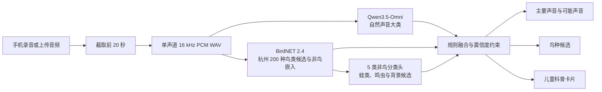

# 自然声探员

面向杭州亲子家庭的自然声音 AI 工具原型：采集户外声音，识别常见物种，生成儿童科普内容，并逐步扩展声音故事、音乐与成长记录。

## 当前进度

- 使用 `uv` 管理 Python 3.11 环境；
- 非破坏性索引 26 条既有物种录音；
- 收集 50 条 Freesound 公开预览背景声；
- 建立包含 76 条录音的本地人工复核工具；
- 完成 BirdNET 2.4 第二阶段基线；
- 接入杭州 200 种鸟类目录，并训练、安装 5 类来源标签非鸟声音基线；
- 生成 142 个三秒候选片段，并按源录音隔离训练、验证和测试集合。
- 跑通 Qwen3.5-Omni + BirdNET 亲子识别 MVP，并加入 20 秒输入提示、可取消等待、谨慎置信度、儿童内容安全护栏和上一次结果恢复。
- 完成体验增强：无模型示例、录音音质检查、结果纠错、本机声音册、分类错误恢复和 24 小时录音清理。
- 跑通 AI 配乐、AI 科普语音、通义万相 Wan 2.7 与 FFmpeg 三轨合成的创作闭环；开发环境默认不调用付费视频接口。
- 完成 Web、Flutter、Android 原生层与 Python 服务端的结构化日志、跨端 trace ID、脱敏滚动日志和端侧诊断导出。
- 接入 Neon 的“共听杭州”比赛 MVP：区域级声景图、匿名探索卡、结构化协助、分层授权与撤回。

所有机器标签均为候选标签，未经人工试听确认的数据不能作为正式测试集。

## 核心识别流程

项目采用“多模态大模型判断声音大类 + 专用声学模型补充鸟种 + 规则层约束输出”的组合方案：



1. **采集录音**：浏览器通过 `MediaRecorder` 录制最长 20 秒的声音，也支持上传 15 MB 以内的常见音频文件。
2. **统一格式**：浏览器将音频转换为单声道、16 kHz、16-bit PCM WAV；本地完整版还会用 FFmpeg 再次解码、截断和标准化。
3. **声音大类识别**：Qwen3.5-Omni 直接理解 WAV 音频，判断鸟类、蛙类、昆虫、雨水、流水、风和树叶、人声、脚步、交通或机械噪声等大类，同时返回听觉依据与不确定性。
4. **多类群候选**：本地完整版并行运行 BirdNET Acoustic 2.4，并用杭州坐标的全年地理先验将 6,522 个输出缩小为 200 种本地鸟类候选；原先验证过的 6 种鸟全部保留。蛙类与鸣虫复用 BirdNET 嵌入，当前已安装由 283 条来源标签录音训练的 5 类基线。它只能给出候选，仍需杭州公园人工听审测试集验证。
5. **结果融合**：系统过滤越界类别，只保留一个主要声音；其他弱线索进入“可能还听到”。BirdNET 候选置信度达到 `0.25` 才展示，达到 `0.5` 才可将鸟声线索提升为较高置信度。
6. **安全展示**：最终科普标题、解释、观察问题和安全提示来自审核过的类别模板，不直接展示未经约束的大模型故事，避免把候选物种写成确定事实。

当前实现没有接入盲源分离、目标声源提取或专用 AI 降噪模型。界面波形用于录音反馈和结果卡片，不是分类模型的输入；嘈杂、混合或目标声音过远的录音仍可能被判为多个候选或“无法判断”。

### 本地完整版与线上展示版

| 能力 | 本地完整版 `app.main:app` | Vercel 线上版 `api/index.py` |
|---|---|---|
| Qwen 声音大类识别 | 支持 | 支持 |
| BirdNET 鸟种候选 | 支持 | 暂不支持 |
| 异步任务与进度查询 | 支持 | 暂不支持，直接返回结果 |
| 原录音回放与服务端任务保存 | 支持，默认保留不超过 24 小时 | 暂不持久化 |
| MiniMax 音乐与旁白、视频合成 | 支持 | 暂不支持 |

线上版用于快速展示“录音 → 声音大类 → 儿童科普卡片”；需要演示鸟种候选和完整创作闭环时，应运行本地完整版。

## 环境

```powershell
uv sync --python 3.11
```

本地 BirdNET/TensorFlow 完整版固定使用 Python 3.11。Vercel 云 API 通过
`.vercelignore` 排除本地模型依赖，只安装 `requirements.txt` 中的轻量 API 依赖。

## 启动亲子 MVP

在根目录 `.env` 配置百炼密钥后运行：

```powershell
uv run uvicorn app.main:app --host 0.0.0.0 --port 8770
```

浏览器打开 `http://127.0.0.1:8770/`。MVP 支持手机录音或上传，使用 Qwen3.5-Omni 识别自然声音大类；本地完整版再用 BirdNET 补充杭州 200 种鸟类候选。蛙类与鸣虫扩展见 [多类群声学识别接入](./docs/20-多类群声学识别接入.md)。

### 启动共听杭州

服务端在 `.env` 中读取 `DATABASE_URL`。首次连接新的 Neon 数据库时执行：

```powershell
uv run python -c "from pathlib import Path; from dotenv import load_dotenv; import os, psycopg; load_dotenv('.env'); connection=psycopg.connect(os.environ['DATABASE_URL']); connection.execute(Path('migrations/001_community_mvp.sql').read_text(encoding='utf-8')); connection.commit(); connection.close()"
```

Android 模拟器默认访问 `http://10.0.2.2:8770`。Release 包默认访问
`https://listen-api.gqy20.top`，也可以通过编译参数覆盖：

```powershell
flutter run --dart-define=COMMUNITY_API_URL=http://192.168.1.10:8770
flutter build apk --release --dart-define=COMMUNITY_API_URL=https://api.example.com
```

共听杭州只上传经成年人单独授权的声音记录，公开区域不包含精确坐标。应用首次访问时会用本机随机 ID 换取服务端签名的匿名 Bearer Token；发布者和协助者身份均由 Token 决定，客户端提交的身份字段不会被信任。线上部署必须设置长度至少 32 个字符的 `COMMUNITY_AUTH_SECRET`。

本地开发默认把声音写入 `outputs/mvp/community_media`。线上部署设置以下环境变量后，会改用任意 S3 兼容对象存储（Cloudflare R2、AWS S3 或 Supabase S3）：

```dotenv
COMMUNITY_S3_ENDPOINT_URL=https://<account>.r2.cloudflarestorage.com
COMMUNITY_S3_ACCESS_KEY_ID=
COMMUNITY_S3_SECRET_ACCESS_KEY=
COMMUNITY_S3_BUCKET=xykw-community
COMMUNITY_S3_PUBLIC_BASE_URL=https://sounds.example.com
COMMUNITY_S3_REGION=auto
COMMUNITY_S3_PREFIX=community
```

When hosted on Vercel, the recommended alternative is a public Vercel Blob
store linked to the API project. Vercel injects `BLOB_READ_WRITE_TOKEN` on the
server; the web app and APK never receive this token. `COMMUNITY_MEDIA_PREFIX`
defaults to `community`.

对象存储配置必须整组提供，缺少任一项时服务端会拒绝启动，避免线上误写临时磁盘。撤回公开记录会同时删除对象存储中的短音频。API 仍有单实例内存限流；正式公开推广时应在 CDN/API Gateway 再增加分布式限流与滥用检测。
Vercel Production 未配置对象存储时仍可浏览声景，但发布接口会返回 `503`，不会假装持久化成功。

本地服务默认在启动完成前预加载 BirdNET 和非鸟分类头，避免第一条录音再承担模型加载时间；`GET /api/health` 的 `models` 字段可查看加载状态和耗时。内存受限时可用 `PRELOAD_MODELS=false` 恢复按需加载。Qwen 客户端仍按需创建，不会在启动时发起网络请求。

线上展示版：[xykw-web.vercel.app](https://xykw-web.vercel.app)。它连接 [xykw-api.vercel.app](https://xykw-api.vercel.app)，使用 Qwen 完成声音大类识别；BirdNET、音乐、旁白和视频创作仍由本地完整版提供。

复制 `.env.example` 后填写密钥。`WAN_VIDEO_MODE` 默认为 `mock`，不会产生视频费用；比赛演示可设为 `reuse` 并指定已有成片，只有最终验收才显式设为 `live`。

## 启动统一标注页面

```powershell
uv run python scripts/prioritize_freesound_review.py
uv run python scripts/prepare_unified_review.py
uv run python scripts/review_freesound.py --port 8767
```

浏览器打开 `http://127.0.0.1:8767/`。

## 复现实验

```powershell
uv run python scripts/index_existing_data.py
uv run python scripts/validate_data_stage1.py
uv run python scripts/run_stage2_birdnet.py
uv run python scripts/validate_stage2.py
uv run python scripts/audit_evaluation_readiness.py
```

已存在 BirdNET 检测结果、仅需重新生成划分和报告时：

```powershell
uv run python scripts/run_stage2_birdnet.py --reuse-detections
```

## 目录

- `docs/`：创意方案、技术调研、杭州物种筛选和实验记录；
- `scripts/`：数据索引、采集、机器预标注、人工复核与基线脚本；
- `data/metadata/`：数据台账、复核队列、检测结果和片段清单；
- `data/raw/`：原始或公开预览音频，不纳入 Git；
- `artifacts/`：可重新生成的实验产物，不纳入 Git。
- `app/`：亲子移动端 MVP、异步分析接口和模型融合流程；
- `mobile/`：Android 优先、兼容后续 iOS 的 Flutter 完整端；
- `outputs/mvp/`：MVP 上传、任务结果和本地测试产物，不纳入 Git。

详细入口见 [项目文档索引](./docs/README.md)。

日志事件、Logcat 命令、trace 关联和隐私边界见 [日志与诊断](./docs/logs.md)。

## ModelScope 创空间

魔搭在线体验：[自然声探员创空间](https://modelscope.cn/studios/gqy2025/nature-sound-detective)。创空间使用与 Android 端同源的 YAMNet、BirdNET 2.4 和本地非鸟 TFLite 模型，在 CPU 环境中提供最长 20 秒的自然声音候选分析。

创空间的可维护源码位于 `deploy/modelscope/`，模型与标签不重复提交，而是在发布前从 `mobile/assets/` 组装到忽略的构建目录：

```powershell
# 生成并检查自包含部署目录
.\scripts\build_modelscope_space.ps1
.\scripts\test_modelscope_space.ps1

# 在 .env 配置 MODELSCOPE_API_TOKEN 后更新创空间
.\scripts\publish_modelscope_space.ps1 `
  -RepositoryUrl "https://www.modelscope.cn/studios/gqy2025/nature-sound-detective.git"
```

发布脚本会拒绝包含 `.env`、ModelScope Token 或 API Key 特征的构建产物。模型输出仍是调查候选，不能替代现场观察和人工复核。
