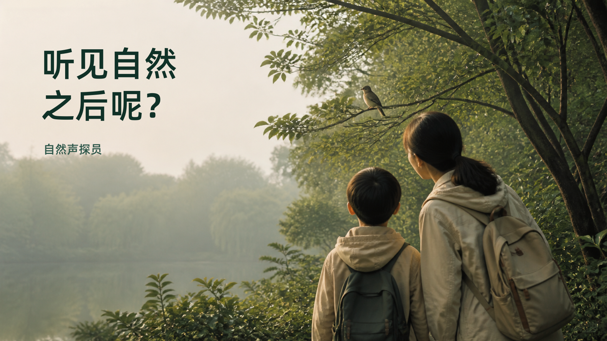

# 《自然声探员》Bilibili 发布方案

> 适用内容：约 110 秒的 16:9 产品宣传片  
> 发布目标：让家长、教育工作者与技术观众在短时间内理解产品价值，并为参赛项目建立可信、可体验的公开入口

---

## 1. 发布定位

这条视频不应被包装成单纯的“AI 识鸟演示”。它真正讲述的是：当孩子在散步中听见一种看不见的声音，家长不需要立即知道答案，也能陪孩子完成一次真实的自然调查。

传播重点依次为：

1. 家长的真实困扰：孩子问起自然声音时，不知道怎样继续引导；
2. 儿童的主动探索：听见、记录、回听、观察、比较和求证；
3. AI 的恰当角色：提供候选和调查线索，不替孩子宣布答案；
4. 产品的完整闭环：个人记录、亲子互动、城市共听与自然明信片；
5. 绿色发展价值：从日常散步进入自然教育与城市生物多样性观察。

---

## 2. 投稿设置

| 项目 | 建议 |
|---|---|
| 投稿类型 | 自制 |
| 推荐分区 | 科技 → 人工智能 |
| 备选分区 | 知识 → 科学科普；若账号长期聚焦自然教育，可使用该分区 |
| 视频比例 | 16:9 |
| 上传版本 | 4K 成片优先；平台转码后仍有更好的文字与地图细节 |
| 字幕 | 使用视频内已烧录字幕，同时上传一份平台字幕便于无障碍观看与检索 |
| AI 标识 | 按发布页面要求勾选或声明 AI 生成内容；简介中说明 AI 仅参与部分视听共创 |
| 转载权限 | 原创项目建议关闭未经许可的转载；保留站内分享 |

分区应以发布页当时提供的实际名称为准。如果“科技 → 人工智能”不可选，优先进入“知识 → 科学科普”，不要为了流量选择与内容无关的分区。

---

## 3. 标题

### 推荐标题

**听见却看不见？我们做了一个陪孩子调查自然声音的 AI 产品**

这个标题同时包含家长能理解的情境、产品动作和 AI 特征，没有把项目缩小成“识鸟工具”。

### 备选标题

1. **AI 不替孩子回答：一次散步如何变成自然调查**
2. **每个孩子都是自然声探员｜AI 儿童自然教育产品**
3. **孩子问“这是什么声音”时，我们想让探索继续发生**
4. **从一段鸟鸣到共听杭州，我们做了一个自然调查 App**
5. **不是识别答案，而是带孩子找到自然线索**

### 不建议使用

- “准确识别所有自然声音”：超出当前验证边界；
- “最强 AI 识鸟神器”：与多类声景和儿童调查定位不符；
- “颠覆自然教育”：缺少对应验证证据；
- 在主标题堆叠完整模型名称：会削弱家长视角，也降低可读性。

---

## 4. 封面方案

### 4.1 推荐封面文案

主文案：

> **听见自然之后呢？**

品牌署名：

> 自然声探员

不建议把视频标题完整复制到封面，也不加入“重磅发布”“震撼上线”等促销式角标。

### 4.2 推荐画面

- 左侧或中左：真实拍摄的鸟停在枝头，主体清晰，但不要直接充满全画面；
- 中部：由鸟鸣方向延伸出的真实声音波形；
- 右侧：产品手机界面，只展示“开始聆听”或候选分析中的一个关键状态；
- 背景：杭州清晨的雾绿与暖灰，不使用高饱和科技蓝紫；
- 关系：真实自然 → 声音线索 → 儿童调查工具，一眼形成阅读顺序。

### 4.3 版式与字体

| 元素 | 字体 | 建议规格 |
|---|---|---|
| 封面主文案 | 得意黑 | 96–118 px，暖白或深墨绿 |
| 品牌名 | 阿里巴巴普惠体 3.0 75 SemiBold | 34–42 px |
| 必要的小标签 | 阿里巴巴普惠体 3.0 55 Regular | 28–32 px |

- 画布按 16:9 制作，建议至少 1920×1080；同时检查中心 4:3 安全区域，避免移动端裁切主文案；
- 主文案最多两行，每行尽量不超过 9 个汉字；
- 不使用描边、厚重投影、发光、渐变大字和多枚标签；
- 只保留一个视觉问题和一个产品名；
- 封面必须与视频实际内容一致。Bilibili 官方投稿提示也建议使用清晰封面，并选择约 4–5 个契合主题的标签。

### 4.4 备选封面文案

- **这个声音藏着什么？**：悬念更强，但更接近片头语言；
- **让孩子自己找到答案**：突出教育价值，但容易误解为最后一定有答案；
- **一次散步 一场调查**：简洁温暖，产品和 AI 信息较弱；
- **AI 不替孩子作答**：观点鲜明，更适合技术或教育受众。

### 4.5 已生成封面候选

三张候选统一使用“听见自然之后呢？”作为主文案，以便只比较画面策略：

| A · 亲子自然叙事 | B · 声音线索悬念 | C · 产品与城市共听 |
|---|---|---|
|  |  |  |

- A 更容易打动家长，情境真实、情绪温暖；
- B 缩略图辨识度最高，声音悬念与影片开场最一致；
- C 产品感和城市协作最强，但信息密度也最高。

---

## 5. 视频简介

### 5.1 推荐发布版

孩子在公园里听见鸟鸣、蛙声、虫鸣或风雨，却看不见声音来自哪里。家长不一定知道答案，但可以陪孩子把好奇变成一次调查。

“自然声探员”是一款面向儿童家庭的 AI 自然声音调查产品。它从孩子亲手录下的真实原声出发，由本地声学模型寻找有效片段并提出自然声音与物种候选，再由千问系列模型把复杂线索转化为孩子能够执行的观察问题。候选不是答案，真正完成回听、观察、比较和求证的，始终是孩子。

完成的调查可以保存在家庭声音册中，成为孩子独一无二的童年自然记忆；经家长单独授权后，匿名线索还可以进入“共听杭州”，让其他自然声探员继续倾听和协助。调查结束后，通义万相 Wan 2.7 还可以参与生成自然明信片画面，让真实原声与观察记录成为可以带回家的作品。

项目参加“小有可为”绿色发展赛道。

项目体验与源码：

- GitHub：https://github.com/gqy20/nature-sound-detective
- 魔搭创空间：https://modelscope.cn/studios/gqy2025/nature-sound-detective
- Web 展示：https://listen.gqy20.top/
- Android 版本：https://github.com/gqy20/nature-sound-detective/releases/tag/0.4.0

说明：模型输出仅作为调查候选，不替代现场观察或专业物种鉴定。视频中的部分自然画面由 AI 生成，并已在画面中标注；真实录音、调查记录与生成内容保持边界。

### 5.2 精简版

当孩子在公园里听见一种看不见的声音，家长不必立即知道答案。

“自然声探员”从真实原声出发，用声学模型寻找候选，用千问系列模型把专业线索转化为现场观察问题，再由孩子通过回听、观察、比较和求证完成调查。记录可以留在家庭声音册；经家长授权后，也可以匿名进入“共听杭州”。

候选不是答案，AI 不替孩子作答。

GitHub：https://github.com/gqy20/nature-sound-detective  
魔搭体验：https://modelscope.cn/studios/gqy2025/nature-sound-detective

---

## 6. 标签与话题

### 推荐的 5 个普通标签

1. 人工智能
2. 自然教育
3. 亲子教育
4. 产品设计
5. 生物多样性

### 可根据分区替换

- 技术观众优先：`人工智能`、`AI应用`、`产品设计`、`开源项目`、`Flutter`
- 家长与教育观众优先：`自然教育`、`亲子教育`、`儿童教育`、`科学启蒙`、`户外探索`
- 绿色发展主题优先：`生物多样性`、`自然观察`、`公民科学`、`绿色发展`、`环境教育`

标签以 4–5 个准确词为宜，不同时堆叠三套标签。正式投稿推荐使用第一组，简介和动态中再自然带出“开源”“千问”“万相”等信息。

### 推荐动态话题文案

> 如果孩子在公园里问你“这段声音里藏着什么”，你会直接给答案，还是陪他继续找线索？我们做了“自然声探员”，想让 AI 把孩子带回自然，而不是留在答案页面。欢迎试听，也欢迎告诉我们：你最希望孩子记录哪一种自然声音？

---

## 7. 置顶评论

> 谢谢你听到这里。这个项目最重要的原则是“候选不是答案”：声学模型和 AI 可以帮助发现线索，但孩子仍要通过回听和现场观察完成判断。  
> 你小时候最熟悉的一种自然声音是什么？欢迎把声音或故事留在评论区。  
> 项目源码、在线体验和 Android 安装入口已放在简介中。

置顶评论的任务不是重复简介，而是建立讨论。优先询问具体记忆或亲子体验，不要只写“求三连”。

---

## 8. 章节与进度条文案

如果发布页支持视频章节，可使用：

| 时间 | 章节名 |
|---|---|
| 00:00 | 听见却看不见 |
| 00:13 | 自然不只有鸟鸣 |
| 00:18 | 每个孩子都能成为探员 |
| 00:24 | 从原声中寻找候选 |
| 00:42 | AI 把线索变成行动 |
| 00:56 | 保存孩子的自然记忆 |
| 01:07 | 从家庭走向共听杭州 |
| 01:30 | 原声与观察长成明信片 |
| 01:46 | 和孩子一起听见自然 |

正式填写前应以最终上传文件重新核对时间点，误差控制在 1 秒以内。

---

## 9. 发布前检查

- [ ] 标题没有宣称“准确识别所有声音”或专家级鉴定能力；
- [ ] 封面与视频内容一致，鸟、波形和产品界面均来自可用素材；
- [ ] 封面主文案在移动端缩略图下仍清晰可读；
- [ ] 简介中的 GitHub、魔搭、Web 与 Android 链接可访问；
- [ ] 视频内 AI 生成画面标识清晰，并按平台要求完成 AI 内容声明；
- [ ] 鸟类图片、真实声音、地图和字体的授权信息已留档；
- [ ] 字幕无黑底、描边或阴影，字号、底边、颜色和换行规则统一；
- [ ] 普通字幕行末不显示句号、逗号、顿号、分号或冒号；
- [ ] 问号只保留在需要观众感知疑问语气的句子中；
- [ ] 上传后完整播放一次，检查平台转码后的地图文字、手机界面和响度；
- [ ] 发布后立即补充置顶评论，并在前 24 小时集中回复真实问题。

---

## 10. 发布策略

建议首发使用推荐标题和“听见自然之后呢？”封面。它没有提前暴露答案，能延续视频的声音悬念，同时把观众从“识别是什么”带向“接下来怎么探索”。

如果首发后点击率偏低，可只替换封面文案进行一次对照：

- A 版：`听见自然之后呢？`——品牌感和教育价值更强；
- B 版：`AI 不替孩子作答`——观点更鲜明，技术受众点击动机更强。

不要同时修改标题和封面，否则无法判断变化来自哪一个因素。
