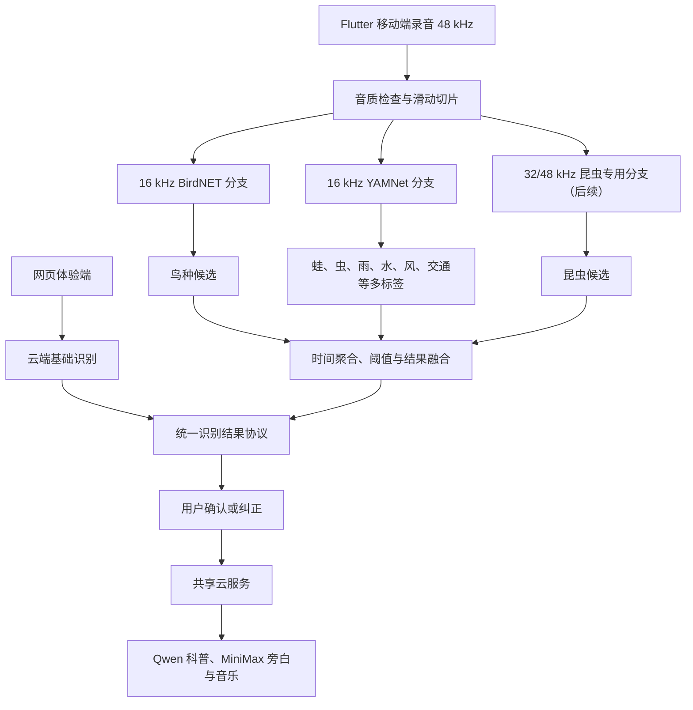

# 非鸟类自然声音识别与 Web + Flutter Mobile 实施计划

> 文档状态：执行草案 v0.3  
> 更新日期：2026-08-02  
> 项目地点：杭州  
> 当前基础：Web 录音与上传、Qwen3.5-Omni 大类判断、BirdNET 鸟种候选、科普与创作链路已经具备

## 1. 目标与结论

项目最终采用“网页体验端 + Flutter 移动端 + 共享云服务”的产品形态。网页端负责低门槛体验、比赛展示和传播，Flutter 移动端负责完整的户外采集、本地识别与成长记录，云端负责科普内容和生成式增强。当前开发与比赛交付以 Android 为主；选择 Flutter 是为了从第一天保留 iOS 扩展能力，而不是要求首版同步完成两个平台。

下一阶段不从零训练通用声学模型，而是在现有系统上增加一条可离线、可复现的非鸟类识别链路：

1. 使用 BirdNET 继续负责鸟类和鸟种候选；
2. 使用 YAMNet 负责蛙类、昆虫、雨水、流水、风、人声、脚步和交通机械等声音大类；
3. 使用杭州本地标注数据，在 YAMNet embedding 上训练小型多标签分类头；
4. Qwen3.5-Omni 逐步从主分类器调整为科普生成、场景总结和低置信度辅助判断；
5. 模型在 Web/Python 端完成评测后，再集成到 Flutter 移动端，避免同时开发两套未经验证的推理流程。

第一版移动端目标是 Android 比赛级 MVP，不是完整商业 App。预计公共 Dart 业务代码和 Android 构建、桥接、测试共约 4,100～7,600 行；后续补齐 iOS 录音、权限、模型打包、签名和真机兼容，预计再增加约 400～1,200 行。模型文件、依赖库、生成文件和数据集不计入代码量。

## 2. 双端产品定位

### 2.1 网页体验端

网页端定位为“打开即用的产品入口”，保留当前已部署站点并逐步增加经过验证的轻量能力：

- 无需安装即可录音或上传声音；
- 返回自然声音大类和有限的候选结果；
- 展示儿童科普卡片、固定案例和产品故事；
- 支持用户确认或纠正结果；
- 在显式触发时调用云端旁白、音乐等生成能力；
- 用于比赛现场演示、微信分享、用户访谈和早期反馈；
- 不承诺离线识别、长期录音保存和完整本地模型能力。

网页端不应只是移动 App 的镜像。它承担体验和传播任务，应保持流程短、模型包轻、无需账号即可开始。

### 2.2 Flutter 移动完整端

Flutter 移动端定位为“正式的户外自然探索工具”。第一阶段完整实现 Android；页面、状态、推理编排、融合、网络和存储从一开始保持跨平台，为第二阶段接入 iOS 做准备：

- 使用 48 kHz PCM/WAV 采集并保存原始声音；
- 通过 ONNX Runtime 和 LiteRT/TFLite 在本地运行 BirdNET、YAMNet 和后续杭州专用分类头；
- 支持混合声景的多标签识别、时间证据和 unknown 拒识；
- 支持用户确认、纠错、收藏、集邮和本地成长记录；
- 断网时仍可录音、识别和查看基础科普；
- 联网后调用云服务生成儿童科普、旁白、音乐和可分享内容；
- 后续按数据条件增加具体蛙种和昆虫物种模型。

移动端不采用简单 WebView 包装。网页可以复用视觉语言和业务协议；Flutter 共享页面、状态、推理编排和存储逻辑，麦克风与模型运行仅在必要时通过 Kotlin/Swift 原生桥接。

### 2.3 云端共享服务

云端不承担 App 的全部识别，而是作为两端共用的内容与增强服务：

- 接收网页上传的音频并执行网页端允许的云端识别；
- 接收移动端已完成或经用户确认的结构化识别结果；
- 校验类别、模型版本和必要字段；
- 读取经过审核的物种与声音知识；
- 使用 Qwen 生成儿童化科普和场景总结；
- 使用 MiniMax 生成旁白与音乐；
- 后续承担账号同步、探索记录备份和模型配置分发；
- 所有第三方 API 密钥仅保存在服务器，不写入网页包、APK 或 IPA。

### 2.4 双端能力边界

| 能力 | 网页体验端 | Flutter 移动完整端 |
|---|---|---|
| 录音、上传、试听 | 支持 | 支持 |
| 声音大类识别 | 云端基础版 | 本地完整支持 |
| BirdNET 鸟种识别 | 可选，由模型服务提供 | 本地完整支持 |
| YAMNet 非鸟类识别 | 可选，由模型服务提供 | 本地完整支持 |
| 杭州专用分类头 | 不作为首版要求 | 数据达标后本地支持 |
| 混合声景多标签 | 基础展示 | 完整结果与时间证据 |
| 离线识别 | 不支持 | 支持 |
| 用户确认与纠错 | 支持 | 支持 |
| 科普卡片 | 支持 | 支持，基础内容可离线 |
| 旁白、音乐和视频 | 云端按需生成 | 调用同一云端服务 |
| 探索记录 | 浏览器短期保存 | 跨平台本地存储长期保存 |
| 打卡、集邮和成长档案 | 体验或预览 | 完整实现 |

两端的功能多少可以不同，但类别 ID、结果字段、模型版本、阈值语义和用户纠错格式必须统一。

### 2.5 移动端技术决策

选择 Flutter/Dart 的原因是项目明确需要 Android 和 iOS，而不是因为 Dart 更适合声音识别：

- 页面、状态机、推理调度、融合、网络和本地记录可跨平台共享；
- `flutter_onnxruntime` 可承载 BirdNET ONNX 推理；
- `tflite_flutter` 可承载 YAMNet 与后续 TFLite 分类头；
- Android 使用 AudioRecord/Oboe，iOS 使用 AVAudioEngine，平台差异收敛到插件层；
- BirdNET Live 证明 Flutter、移动端 PCM、ONNX 和实时声学处理可以协同工作，但本项目不 Fork 其完整 App，只参考公开的输入参数、推理调度和模型打包方法；
- 当前网页保持独立，不迁移到 Flutter Web。

交付顺序明确为：

1. 先在 Android 上完成录音、BirdNET、YAMNet、融合、结果页和云端联通；
2. Android 主流程稳定后，冻结 Dart 公共接口和固定测试样例；
3. 再补齐 iOS 麦克风、模型资源、权限、签名与真机兼容；
4. iOS 复用同一套 Dart 产品逻辑，不重新实现一套 Swift App。

不选择 Kotlin 单端先行，是为了避免未来以 Swift 重写录音、推理、存储和完整产品流程。第一阶段不把 iPhone 交付作为 Android MVP 的阻塞条件；进入 iOS 阶段前仍需准备 macOS、Xcode、Apple Developer 配置与 iPhone 真机。

## 3. 第一版范围

### 3.1 必须支持

- 手机录音、停止、试听和重新录制；
- 对 5～20 秒自然声进行音质检查；
- 鸟类分支使用 BirdNET 输出杭州常见鸟种候选；
- 通用分支使用 YAMNet 输出多个同时存在的声音大类；
- 显示类别、置信度、出现时间段和不确定提示；
- 支持用户纠正机器判断；
- 将确认结果提交给现有后端，生成儿童科普卡片；
- 网络可用时生成旁白、音乐等内容；
- 网络不可用时仍能完成基础录音与本地识别；
- 保存最近的本地探索记录。

### 3.2 第一版目标类别

| 类型 | 第一版输出粒度 | 模型路径 |
|---|---|---|
| 鸟类 | 常见鸟种候选 | BirdNET |
| 蛙类 | 先输出“蛙类鸣叫” | YAMNet，后续本地分类头 |
| 昆虫 | 先输出“昆虫鸣叫” | YAMNet，后续高采样率专用模型 |
| 雨水 | 声音大类 | YAMNet |
| 流水 | 声音大类 | YAMNet |
| 风和树叶 | 声音大类 | YAMNet |
| 人声 | 声音大类，仅用于环境说明 | YAMNet |
| 脚步 | 声音大类 | YAMNet |
| 交通或机械噪声 | 声音大类 | YAMNet |
| 未知 | 所有目标均低于阈值 | 拒识规则 |

### 3.3 暂不承诺

- 任意蛙种、昆虫物种的开放世界识别；
- 实时盲源分离或目标声源提取；
- 完全离线的音乐、旁白和视频生成；
- 用户账号、亲子家庭体系、排行榜和社交社区；
- iOS 客户端；
- 商业级全设备兼容、长期后台录音和大规模云同步。

## 4. 目标架构



设计原则：

- 原始录音以 48 kHz 保存，满足未来昆虫高频识别需要；
- 网页和 Flutter 移动端不共享 UI 实现，但共享协议、类别表、模型元数据和固定测试样例；
- Android 与 iOS 共享 Dart UI、业务状态、推理编排、融合与网络层；平台插件只暴露统一 PCM 和模型运行接口；
- BirdNET 和 YAMNet 分别按自身要求获得重采样副本；
- 户外声音允许同时出现多个类别，分类器使用多标签输出而不是单选分类；
- 每个模型保留独立原始分数，融合层不覆盖模型证据；
- 低置信度时返回“不确定”或邀请用户确认，不强制猜测；
- 付费 API 不参与自动回归测试，默认使用 mock、缓存或固定样例。

## 5. 分阶段实施

### 阶段 A：数据与评测基础

目标：先建立可信测试集，避免只凭演示样例判断效果。

任务：

- 核查 `data/` 中来源、许可、标签、地点和录音者信息；
- 区分人工确认标签、文件名推断标签和模型候选标签；
- 筛选蛙、虫、雨、水、风、人声、脚步、交通和纯背景样本；
- 按原始录音来源划分 train/validation/test，禁止同源切片泄漏；
- 建立杭州手机实录小测试集；
- 增加困难负样本，例如虫鸣与鸟鸣、风声与流水、蛙声与机械周期声；
- 固化无需付费 API 的评测命令和结果格式。

交付物：

- 数据台账与许可检查结果；
- 非鸟类类别清单；
- 独立测试集清单；
- 基线评测脚本和报告模板。

退出条件：至少每个目标大类拥有可人工复听的测试样本；正式指标只使用人工确认标签。

### 阶段 B：YAMNet Web 基线

目标：在现有 Python 后端接入开源通用声音分类器，不改动付费内容生成链路。

任务：

- 通过 `uv` 添加并锁定 YAMNet 推理依赖；
- 实现 16 kHz 单声道输入适配；
- 保存每个约 0.96 秒窗口的 521 类原始分数与 1024 维 embedding；
- 建立 YAMNet 标签到产品中文大类的可配置映射；
- 实现逐类阈值、时间平滑、连续区间合并和 unknown 拒识；
- 让 BirdNET 与 YAMNet 并行执行；
- 扩展现有 API 和前端结果卡，展示多标签与证据时间段；
- 增加单元测试、固定 WAV 集成测试和无付费 API 回归测试。

预计代码量：600～1,200 行。  
预计时间：2～4 个开发日。

退出条件：固定样例能够稳定复现；非鸟类结果不依赖 Qwen；测试过程不会触发 Qwen、MiniMax 或视频 API。

### 阶段 C：杭州本地多标签分类头

目标：在数据足够时提升 YAMNet 原始通用标签在杭州场景中的效果。

任务：

- 批量提取并缓存 YAMNet embedding；
- 先比较 Logistic Regression、SVM 和小型 MLP；
- MLP 推荐结构为 `1024 → 256 → N`，输出使用 sigmoid；
- 使用 `BCEWithLogitsLoss`，为类别不平衡设置权重；
- 加入随机增益、时间平移、背景叠加、SpecAugment 和 Mixup；
- 对每个类别分别选择阈值；
- 报告 precision、recall、F1、PR-AUC、拒识率和推理耗时；
- 导出 TFLite 或 ONNX 模型，并记录类别表、阈值和模型版本。

预计代码量：800～1,800 行。  
预计时间：开发 1～2 周；数据整理时间另计。

退出条件：在独立杭州测试集上，相比原始 YAMNet 有稳定提升；如果没有提升，则继续使用原始 YAMNet，不为了“自研”强行上线分类头。

### 阶段 D：Flutter Android MVP

目标：使用 Flutter 工程优先完成 Android 的本地录音、BirdNET/YAMNet 离线推理、结果确认和现有生成服务联通，同时保持公共 Dart 层不依赖 Android 专属实现。

建议技术栈：

- Dart + Flutter；
- Flutter 官方推荐的 View/ViewModel、Repository、Service 分层；
- `flutter_onnxruntime` 运行 BirdNET ONNX；
- `tflite_flutter` 运行 YAMNet 和杭州本地分类头；
- 跨平台本地数据库保存探索记录，简单设置使用 `shared_preferences`；
- Dart HTTP 客户端连接现有后端；
- 自有 `AudioCapture` 接口统一输出 48 kHz PCM；
- Android 必要时以 Kotlin 封装 AudioRecord/Oboe；
- iOS 必要时以 Swift 封装 AVAudioEngine；
- MethodChannel/EventChannel 只承载平台差异，不放产品业务逻辑。

任务拆分与代码量：

| 模块 | 预计代码量 |
|---|---:|
| Flutter 页面、导航、状态管理 | 900～1,500 行 |
| 跨平台录音、权限、音频文件管理 | 600～1,000 行 |
| YAMNet TFLite 本地推理 | 400～800 行 |
| BirdNET ONNX 本地推理 | 500～900 行 |
| 滑动窗口、时间聚合与融合 | 400～700 行 |
| 后端 API、任务状态与失败恢复 | 300～600 行 |
| 本地历史记录与设置 | 300～600 行 |
| Kotlin Android 平台桥接 | 200～600 行 |
| 测试、错误处理和 Android 构建配置 | 500～900 行 |
| Android 首版合计 | 约 4,100～7,600 行 |
| 后续 Swift/iOS 适配增量 | 400～1,200 行 |

预计时间：Android 比赛版单人 2～4 周；可以先冻结长时后台监听等非核心能力。  
退出条件：主流程在目标 Android 真机上连续演示三次；断网时仍能录音和识别；联网后能完成科普生成；公共层没有直接依赖 Android UI 或平台对象。

### 阶段 E：iOS 适配

目标：在不重写产品逻辑的前提下，使已经稳定的 Flutter Android 应用运行于 iPhone。

任务：

- 在 macOS/Xcode 环境验证 Flutter 工程与依赖；
- 适配 AVAudioEngine 或验证现有录音插件的 PCM 输出；
- 验证 ONNX Runtime 与 TFLite 模型在 iOS 上的加载、内存和速度；
- 配置麦克风、文件、网络和隐私权限说明；
- 处理模型资源打包、按需下载和校验；
- 使用与 Android 相同的固定 WAV、JSON 和融合契约测试；
- 完成签名、真机安装和 TestFlight 验证。

退出条件：Android 与 iOS 对固定样例产生语义一致的结果；iPhone 真机能够完成录音、离线识别和联网科普生成。

### 阶段 F：具体蛙种与昆虫物种

此阶段由数据条件触发，不纳入第一版 Flutter Android MVP 完成标准。

蛙类路线：

- 由生态人员确定 3～5 种杭州常见目标蛙；
- 收集经过人工或专家确认的单物种叫声；
- 使用 YAMNet/PANNs embedding 加小型分类头；
- 将其他蛙、昆虫和周期机械声作为困难负样本；
- 仅对达到验收门槛的物种开放具体名称，否则仍显示“蛙类鸣叫”。

昆虫路线：

- 保留 32/48 kHz 推理输入，避免 16 kHz 丢失高频信息；
- 先完成“昆虫鸣叫”大类，再研究具体虫种；
- 比较高采样率 Log-Mel CNN/CRNN 与专用预训练模型；
- 对不同手机麦克风进行实录验证；
- 数据不足时不输出具体物种。

## 6. 代码目录建议

采用单仓库双端结构。当前阶段不大规模移动已经部署的 `app/` 和 `api/`，先增加共享协议、模型清单和 Flutter 移动工程；双端稳定后再考虑把 Python 服务统一迁移到 `server/`：

```text
xykw/
├─ app/                              # 当前本地 Python 完整服务，暂时保留
│  ├─ yamnet_service.py
│  ├─ audio_event_mapping.py
│  ├─ temporal_aggregation.py
│  └─ result_fusion.py
├─ api/                              # 当前网页端 Vercel 轻量 API
├─ app/static/                       # 当前网页体验端
├─ contracts/                        # Web、Flutter、Python 共用协议
│  ├─ openapi.yaml
│  ├─ analysis-result.schema.json
│  ├─ model-manifest.schema.json
│  └─ examples/
├─ models/
│  ├─ manifests/                     # 模型版本、采样率、阈值、许可和校验和
│  └─ README.md                      # 模型获取与更新说明
├─ ml/
│  ├─ configs/
│  │  ├─ audio_event_classes.json
│  │  └─ audio_event_thresholds.json
│  ├─ training/
│  │  ├─ extract_yamnet_embeddings.py
│  │  └─ train_audio_event_head.py
│  ├─ evaluation/
│  │  └─ evaluate_audio_events.py
│  └─ export/                        # TFLite/ONNX 导出与一致性检查
├─ tests/
│  ├─ fixtures/audio/
│  ├─ test_yamnet_service.py
│  ├─ test_temporal_aggregation.py
│  └─ test_multimodel_fusion.py
└─ mobile/                           # 阶段 D 创建的 Flutter 工程
   ├─ pubspec.yaml
   ├─ lib/
   │  ├─ main.dart
   │  ├─ app/                        # 路由、主题与应用级状态
   │  ├─ core/
   │  │  ├─ audio/                  # 平台无关 PCM、WAV、缓冲与音质接口
   │  │  ├─ inference/              # BirdNET、YAMNet 与模型管理
   │  │  ├─ fusion/                 # 阈值、时间聚合与拒识
   │  │  ├─ models/                 # Dart 领域模型与协议映射
   │  │  ├─ network/                # 共享云服务客户端
   │  │  └─ storage/                # 探索记录与设置
   │  └─ features/
   │     ├─ onboarding/
   │     ├─ recording/
   │     ├─ analysis/
   │     ├─ result/
   │     ├─ creation/
   │     ├─ stamps/
   │     └─ history/
   ├─ assets/
   │  ├─ models/
   │  ├─ labels/
   │  ├─ knowledge/
   │  └─ samples/
   ├─ android/                       # Kotlin 平台桥接与 Android 构建
   ├─ ios/                           # Swift 平台桥接与 iOS 构建
   ├─ test/
   └─ integration_test/
```

大型模型权重、缓存 embedding、用户录音和训练数据不提交 Git。仓库只保留下载说明、校验和、许可记录、小型合法样例和可复现实验配置。

Web 和 Flutter 移动端不共享界面代码，也不在移动端嵌入 Python。两端共享的是 OpenAPI/JSON Schema、类别 ID、知识字段、模型元数据、阈值版本和固定测试样例。Android 与 iOS 共享 Dart 业务代码，只在不可避免的平台能力上分别保留 Kotlin 和 Swift 实现。

## 7. 统一识别结果协议

Web 和 Flutter 移动端共用结构化结果，避免为不同终端维护两套逻辑：

```json
{
  "recording_id": "rec_001",
  "source": "mobile",
  "platform": "android",
  "contract_version": "1.0",
  "audio_quality": {
    "usable": true,
    "warnings": []
  },
  "detections": [
    {
      "category_id": "frog",
      "name_zh": "蛙类鸣叫",
      "confidence": 0.82,
      "model": "yamnet-local-head-v1",
      "intervals": [{"start": 2.4, "end": 7.2}],
      "specific_species": null
    },
    {
      "category_id": "running_water",
      "name_zh": "流水",
      "confidence": 0.67,
      "model": "yamnet-v1",
      "intervals": [{"start": 0.0, "end": 10.0}],
      "specific_species": null
    }
  ],
  "unknown": false,
  "requires_confirmation": true,
  "confirmed_by_user": false
}
```

置信度只能在同一模型和同一版本内解释，界面不得把未经校准的分数描述成“准确率”。

建议统一云端主接口：

- `POST /api/v1/web-analyses`：网页上传声音并使用云端基础识别；
- `POST /api/v1/explorations`：Flutter 移动端提交本地识别及用户确认结果；
- `GET /api/v1/explorations/{id}`：读取统一探索记录；
- `POST /api/v1/explorations/{id}/creation`：启动科普、旁白或音乐生成；
- `GET /api/v1/jobs/{id}`：统一查询异步任务；
- `GET /api/v1/capabilities`：告知终端当前可用的识别与生成功能。

网页云识别和移动端本地识别可以由不同模型执行，但提交到内容服务前必须转换为同一协议。

## 8. 验收指标

### 8.1 模型验收

- 使用人工确认、按原始录音来源隔离的测试集；
- 分别报告每类 precision、recall、F1 和 PR-AUC；
- 单独报告安静单源、真实混合声景和纯背景结果；
- 评估多标签命中情况，而不是只看 Top-1；
- 报告 unknown 拒识率和高置信误报；
- 对高风险误报优先提高 precision，不用降低阈值制造“什么都能识别”的效果；
- 保存模型版本、标签映射版本和阈值版本。

第一轮不预设虚假的高准确率目标。完成可信测试集后，再根据基线确定具体门槛。

### 8.2 网页端验收

- 无需账号即可完成录音或上传、基础识别和科普卡片展示；
- 页面清楚说明网页端与移动完整端的能力差异；
- 网页端模型不可用时仍可播放固定案例，不伪造实时识别结果；
- 不因用户打开页面或自动回归而触发付费 API；
- 云端无 BirdNET 或媒体生成能力时，由 `/api/v1/capabilities` 驱动界面降级；
- 手机浏览器主流程连续运行三次无阻断；
- 原始录音默认不公开，并明确临时保存策略。

### 8.3 Flutter Android 首版验收

- Android 首次安装能够正确请求麦克风权限；
- 录音、试听、取消、重新录制均可用；
- 飞行模式下可以完成 BirdNET 与 YAMNet 本地识别；
- 20 秒录音不会导致明显卡顿或内存异常；
- 连续三次运行固定演示样例得到一致结果；
- 识别任务可取消，离开页面不会继续泄漏资源；
- 网络或付费生成 API 失败时保留识别结果；
- 原始录音默认不公开，提供清除本地数据入口；
- 至少在一台中端 Android 真机上完成性能、内存和功耗测试；
- Dart 公共层运行契约测试，Kotlin 桥接层运行 Android 平台集成测试；
- 公共层不直接引用 Android Activity、Context 或平台 UI 对象。

### 8.4 iOS 后续验收

- iPhone 首次安装能够正确请求麦克风权限；
- 使用与 Android 相同的录音、推理、融合和结果页面 Dart 逻辑；
- Swift 桥接层只承担 AVAudioEngine、文件和必要平台能力；
- 固定 WAV 的类别排名和融合结果与 Android 语义一致；
- 至少在一台 iPhone 真机上完成性能、内存和功耗测试；
- 完成 Xcode 签名、模型资源打包和 TestFlight/真机安装验证。

## 9. 风险与控制

| 风险 | 表现 | 控制方式 |
|---|---|---|
| 标签不可信 | 文件名或搜索词被当成真值 | 人工复听，记录 `label_status` |
| 混合声景 | 同时有蛙、虫、流水和交通声 | 使用多标签模型与真实混音测试 |
| 昆虫高频丢失 | 16 kHz 输入无法保留目标频段 | 原始录音保持 48 kHz，专用分支后置 |
| 模型分数不可比 | BirdNET、YAMNet、Qwen 分数语义不同 | 分模型校准，融合层保留来源 |
| 手机性能差异 | 推理慢、耗电或录音质量不一致 | 量化模型、双平台真机基准、后台推理 |
| 安装包体积增加 | 多模型导致 APK/IPA 过大 | 按需下载或模型压缩，记录校验和 |
| API 费用失控 | 自动测试触发 Qwen/MiniMax/视频接口 | 默认 mock，显式开关才允许 live |
| 许可不清晰 | 公共数据不能用于商业产品 | 数据台账逐条记录作者和许可 |
| 自研分类头无提升 | 数据不足或域差异过大 | 与原始 YAMNet 做消融，无提升不上线 |
| 双端结果漂移 | Web 和 Flutter 使用不同字段或融合规则 | 共享 Schema、类别表和契约测试样例 |
| 服务能力不一致 | 本地、Vercel 和完整后端返回行为不同 | 统一 `/api/v1` 协议和 capabilities 接口 |
| 密钥泄露 | 把 Qwen 或 MiniMax 密钥打入 APK/IPA | 第三方生成 API 只允许服务器调用 |
| Flutter 插件差异 | Android 可用但 iOS 录音或模型插件行为不同 | 自有抽象接口、固定 WAV 测试、必要时写小型原生桥接 |
| iOS 构建资源不足 | Windows 无法完成 iOS 签名与真机测试 | 提前准备 Mac、Xcode、开发者账号与 iPhone |

## 10. 决策门槛

按以下顺序推进，前一门槛未通过时不扩大工程范围：

1. **G0：数据可评测**——目标大类都有人工确认样本；
2. **G1：YAMNet 可用**——固定样例和真实录音能够稳定输出非鸟类大类；
3. **G2：融合可用**——BirdNET 与 YAMNet 并行且不会相互覆盖证据；
4. **G3：双端协议冻结**——网页、后端和 Flutter 使用同一结果 Schema 与能力描述；
5. **G4：本地分类头有收益**——独立测试集上优于原始 YAMNet；
6. **G5：Flutter Android 开工**——模型、标签、阈值和结果协议冻结，Android 构建与真机资源可用；
7. **G6：iOS 适配开工**——Android 主流程稳定，并具备 Mac、Xcode、开发者配置和 iPhone 真机；
8. **G7：物种级扩展**——某一蛙种或虫种拥有足够可信的杭州数据。

## 11. 建议近期任务顺序

### 第一批：立即执行

1. 审计 `data/` 中非鸟类素材和标签状态；
2. 建立非鸟类测试清单；
3. 在 Python 中接入 YAMNet；
4. 用固定本地 WAV 完成无付费 API 基线测试；
5. 将大类结果接入现有 `result_fusion`；
6. 创建 `contracts/` 并固化第一版识别结果 Schema；
7. 更新前端，使同一录音可以展示多个声音类别。

### 第二批：基线完成后

1. 收集杭州本地蛙、虫和典型环境声；
2. 提取 YAMNet embedding；
3. 训练并对比简单分类头；
4. 固化模型、阈值和评测报告；
5. 统一本地与 Vercel 的 `/api/v1` 返回协议；
6. 增加 capabilities 接口和无付费 API 契约测试；
7. 确定 Android 与 iOS 的模型格式、内存和安装包大小预算。

### 第三批：Flutter Android 首版

1. 创建最小 Flutter 工程并同时生成 `android/` 与 `ios/` 平台目录；
2. 定义 `AudioCapture`、`AudioClassifier` 和 `LocalStore` 跨平台接口；
3. 完成 48 kHz PCM/WAV 录音管线并在 Android 真机验证；
4. 通过 `tflite_flutter` 接入 YAMNet；
5. 通过 `flutter_onnxruntime` 接入 BirdNET；
6. 完成融合、结果确认和本地历史记录；
7. 接通现有后端科普生成接口；
8. 完成 Android 的性能、弱网、断网、权限和隐私回归。

### 第四批：iOS 适配与双端联调

1. 使用同一批固定 JSON/WAV 样例验证网页、Python、Android 和 iOS；
2. 验证网页云识别与 Flutter 本地识别都能进入共享内容服务；
3. 验证 capabilities 降级，不让界面展示当前环境不支持的按钮；
4. 验证 Qwen、MiniMax 和视频接口默认不会被自动调用；
5. 完成网页体验入口到移动完整产品的清晰引导。

## 12. 完成定义

当以下条件全部满足时，认为 Web + Flutter Android 比赛级 MVP 完成，并具备后续 iOS 扩展基础：

- 网页无需安装即可完成录音、基础识别和科普体验；
- 网页在模型服务不可用时能够诚实降级，而不是伪造结果；
- Android 真机能够录制一段自然声音；
- 无网络时能够识别鸟类候选及非鸟类声音大类；
- 混合声景允许同时返回多个候选和对应时间段；
- 低置信结果不会被包装成确定物种；
- 用户可以确认或纠正结果；
- 联网时能把确认结果转换为儿童科普内容；
- 网页识别结果和 Flutter 本地识别结果都能进入同一云端内容服务；
- 两端使用相同的类别 ID、结果协议和用户纠错格式；
- 付费生成接口失败不会破坏主识别流程；
- 固定演示样例、真实杭州录音和纯背景样例均有可复现测试记录；
- 数据、模型、阈值和结果协议均有明确版本。

iPhone 真机运行、TestFlight 和 App Store 交付属于后续 iOS 阶段，不阻塞当前 Android 比赛版验收；但 Flutter 公共层、模型接口和结果协议必须保持跨平台，不能以 Android 专属实现污染业务层。

## 13. 实施进度（2026-08-02）

Android 比赛版的代码主链路已经完成：Flutter 双平台骨架、48 kHz WAV 录音、音质检查与回放、YAMNet 通用声音识别、BirdNET 杭州鸟种候选、融合解释、声音册，以及用户确认后调用云端科普接口。两套 TFLite 推理在后台 isolate 执行，避免长音频分析直接阻塞界面。

当前能力边界如下：

- 鸟类：BirdNET 已从首批 6 种扩展到杭州 200 种候选；候选表由杭州坐标的全年地理先验离线生成，并保留 6 种已验证物种；
- 非鸟类：YAMNet 先识别蛙声、昆虫声、流水、风雨等声音大类，尚不能稳定判断具体蛙种或昆虫种；
- 云端：只在用户主动确认后调用，测试与构建不触发付费 API；
- 数据：声音册保存于 App 私有目录，支持查看和删除，不自动上传；
- 平台：Android APK 已能构建，iOS 工程与公共 Dart 抽象已保留。
- 诊断：Flutter、Android、Web、Vercel 与本地 FastAPI 已使用结构化事件；录音 ID 作为 trace 贯穿端侧和云端，App 可导出脱敏滚动日志。

以下项目仍属于发布前验收，不应描述为已经完成：

1. 在至少一台目标 Android 真机上验证录音、真实模型推理、回放和本地保存；
2. 使用杭州实录样本测量端侧延迟、峰值内存、误报与漏报；
3. 连续三次跑通“录音—本地识别—保存—用户确认—云端科普”；
4. 用杭州实录评测 200 种 BirdNET 候选的阈值与误报，并为具体蛙种/昆虫种准备经专家复核的数据集；
5. 在 macOS/Xcode 和 iPhone 上完成 iOS 插件、权限、模型打包及签名适配。

完成上述 MVP 不等于具体蛙种或昆虫物种已经达到可用水平。物种级能力必须单独通过数据门槛和正式评测后才能对外展示。
