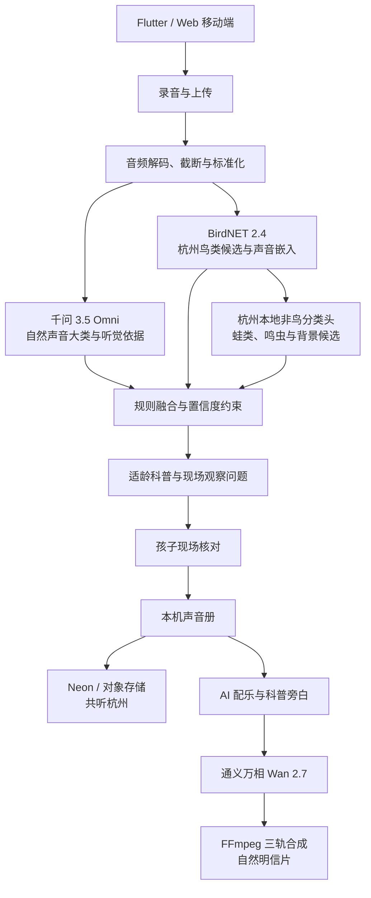

# 自然声探员

> 面向儿童家庭的 AI 自然声音调查产品  
> 项目参赛说明书（Markdown 审阅版）

---

## 1. 项目摘要

“自然声探员”是一款面向儿童及其家庭的 AI 自然调查产品。孩子可以在散步中录下鸟鸣、蛙声、虫鸣、流水、风雨等真实自然声音，系统通过多模型协作提出声音大类与物种候选，再将复杂的分析结果转化为儿童能够理解和执行的观察问题，引导孩子继续回听、观察、比较与现场求证。

产品不把“快速给出一个答案”作为终点，而是希望帮助孩子掌握一套探索自然的方法：**听见—记录—分析—观察—求证**。调查完成后，真实原声、时间、模糊地点和孩子的观察可以保存到声音册；经家长单独授权后，匿名声音线索还可以进入“共听杭州”，由其他自然声探员继续倾听和协助。孩子也可以邀请 AI 将真实原声与观察记录共创为一张自然明信片，让一次普通散步成为独一无二的童年自然记忆。

### 一句话定位

> 自然声探员，是一个从真实自然声音出发，连接家庭探索、AI 辅助与城市协作的儿童自然调查平台。

### 核心主张

> **候选，不是答案。AI 提供线索，孩子完成调查。**

### 核心用户

- 6—12 岁儿童及其家长；
- 开展自然观察活动的学校、教师和自然教育机构；
- 对城市自然声景和生物多样性感兴趣的公众参与者。

---

## 2. 项目背景与用户问题

周末的公园里，孩子可能会突然停下来问：“妈妈，这段声音里，藏着什么？”

这类问题本身就是自然教育最珍贵的起点，但家长常常缺少相关知识和合适的引导工具。普通识别软件能够迅速给出一个名称，却也可能让探索在答案出现的一刻结束。对于孩子而言，真正有价值的不只是知道“它是什么”，而是学习怎样收集证据、怎样观察环境、怎样比较候选，以及怎样在暂时不能确定时保留不确定性。

### 2.1 家长面临的问题

- 希望孩子多接触自然，但不知道如何持续引导；
- 缺少物种和声景知识，难以回应孩子的现场问题；
- 普通散步容易变成走马观花，缺少共同任务；
- 识别工具往往直接给出结论，亲子讨论空间较少；
- 孩子的自然发现散落在相册和录音中，难以形成长期记录。

### 2.2 孩子面临的问题

- 听见声音，却不知道下一步应该观察什么；
- 面对专业名称、置信度和复杂声景时理解门槛较高；
- 容易把模型候选误认为确定答案；
- 一次识别结束后，缺少继续探索和再次参与的动力；
- 自己的发现难以与其他孩子产生联系。

### 2.3 项目机会

自然声探员希望把 AI 从“答案机器”变成“探索支架”：专用模型帮助发现候选，千问系列模型帮助理解复杂声景与组织调查线索，最终判断仍由孩子结合现场观察完成。

---

## 3. 产品定位与设计原则

### 3.1 产品定位

自然声探员不是只识别鸟类的工具，也不是单纯的儿童百科或 AI 图片生成器。它是一款以真实声音为证据、以儿童主动调查为核心、以家庭与城市协作为延伸的自然教育产品。

### 3.2 三项设计原则

#### 真实优先

保留真实原声、采集时间、经过模糊处理的位置和孩子自己的观察。AI 生成内容不替代真实证据。

#### 候选而非答案

所有机器标签均作为候选呈现。系统允许“无法判断”和“保留不确定”，避免把模型结果包装成确定事实。

#### AI 不替孩子作答

AI 将专业结果转化为儿童可以执行的问题，例如“声音来自树冠还是灌木”“节奏是否重复”。孩子通过现场观察决定是否确认、修改或暂不判断。

---

## 4. 典型使用故事

1. 孩子在杭州的公园中听见一段看不见的声音；
2. 打开自然声探员，录下最长 20 秒的真实原声；
3. 产品先检查录音是否足够清晰，避免在质量过低时强行判断；
4. 系统分析有效声段，提出自然声音大类、鸟类或其他声景候选；
5. AI 将候选和听觉依据转化为适龄的现场观察问题；
6. 孩子回听声音，观察树冠、灌木、水边、天气和时间；
7. 孩子比较候选，确认、修改或保留“不确定”；
8. 原声、时间、模糊地点和孩子的观察被保存到声音册；
9. 经家长单独授权后，匿名线索可以进入“共听杭州”；
10. 其他探员继续倾听、比较和协助；
11. 调查完成后，AI 将真实原声与观察共创为自然明信片；
12. 明信片可以留在自然册，也可以分享给家人。

---

## 5. 产品功能

### 5.1 自然声音采集

- 支持手机录音和常见音频文件上传；
- 单次录音最长 20 秒，上传文件不超过 15 MB；
- 提供录音反馈、原声回放和录音质量检查；
- 支持鸟鸣、蛙声、虫鸣、雨水、流水、风与树叶等多类声景；
- 嘈杂、混合或目标声音过远时，允许返回多个候选或“无法判断”。

### 5.2 有效声段与候选分析

- 将输入统一为单声道、16 kHz、16-bit PCM WAV；
- 分析主要声音及可能同时存在的其他声音；
- 提供候选声音类别、鸟种候选、对应时间片段和谨慎置信度；
- 使用杭州本地物种目录和地理先验缩小候选范围；
- 通过规则层过滤越界类别和过低置信度结果；
- 明确提示“候选不是答案”，避免误导儿童。

### 5.3 AI 调查线索转译

- 将专业模型结果转化为儿童可以理解的语言；
- 结合声音、时间、环境与候选，提出下一步观察问题；
- 引导孩子关注声音方向、重复节奏、树冠或灌木、水边等现场特征；
- 使用审核过的类别模板生成科普标题、解释、观察问题和安全提示；
- 支持结果纠错，让孩子和家长可以修正候选。

### 5.4 声音册与调查记录

- 保存真实原声及回放入口；
- 保存采集时间和经过模糊处理的位置；
- 保存候选、孩子的观察与判断；
- 保留尚未确定的部分，而不是强制选择答案；
- 在本机形成儿童和家庭的自然声音档案。

> 留下的不只是一次调查，更是孩子独一无二的自然记忆。

### 5.5 共听杭州

- 以杭州区域级声景地图呈现公开声音线索；
- 提供“今日新声”“等待协助”和任务入口；
- 支持其他探员继续倾听、比较候选和提交结构化协助；
- 只有经成年人单独授权的记录才能公开；
- 公开区域不包含精确坐标和儿童真实身份；
- 发布者可以撤回公开记录，相关公开音频同步删除。

### 5.6 AI 自然明信片

- 使用真实原声和孩子的观察作为创作起点；
- 通过 AI 生成配乐、儿童科普旁白和自然画面；
- 使用通义万相 Wan 2.7 生成自然主题视频画面；
- 使用 FFmpeg 合成原声、配乐、旁白与画面；
- 可保存到自然册或分享给家人；
- 明确标注 AI 生成内容；
- 生成内容仅作为调查完成后的创作表达，不作为识别证据。

### 5.7 体验与工程保障

- 异步分析任务与进度查询；
- 等待过程可取消，上次结果可恢复；
- 结构化日志、跨端 trace ID 与脱敏诊断导出；
- 录音默认保留不超过 24 小时，降低长期存储风险；
- 提供无模型示例和错误恢复，保障演示与弱网场景的可理解性。

---

## 6. 产品亮点

### 亮点一：从“识别答案”走向“儿童调查”

多数识别产品在名称出现时结束，自然声探员则从候选开始。产品持续引导孩子回听、观察、比较和求证，让 AI 成为科学探究过程的支架。

### 亮点二：从单一鸟类走向完整自然声景

项目不仅关注鸟鸣，也关注蛙声、鸣虫、流水、风雨等自然声音，并能识别人声、交通和机械噪声等干扰类别，帮助儿童理解自然环境由多种声音共同构成。

### 亮点三：从个人记录走向城市共听

经家长授权的匿名声音线索可以进入杭州区域级地图。其他探员能够继续倾听和提供结构化协助，让一次个人发现成为城市共同调查的一部分。

### 亮点四：从调查结果走向童年自然记忆

真实原声、时间、模糊地点、儿童观察和 AI 共创作品共同组成一份可长期保存的自然记忆，增强产品的情感价值和持续使用动力。

### 亮点五：多模型分工，而非单一模型包装全部能力

项目根据不同任务选择不同技术：千问负责复杂声景理解，BirdNET 负责鸟类候选，本地分类头补充蛙类和鸣虫，规则层约束输出，万相负责调查完成后的视觉共创。各模型职责清晰，生成内容与识别证据相互隔离。

---

## 7. 技术方案与特色

### 7.1 总体架构

### 7.2 音频预处理

系统将录音或上传音频截取至前 20 秒，并统一转换为单声道、16 kHz、16-bit PCM WAV。本地完整版通过 FFmpeg 再次解码、截断和标准化，保证不同手机和文件格式能够进入一致的分析流程。

当前系统没有接入盲源分离、目标声源提取或专用 AI 降噪模型。界面中的波形用于录音反馈和结果展示，并不是分类模型的直接输入。文档明确这一边界，避免夸大复杂混合声景下的识别能力。

### 7.3 千问 3.5 Omni：复杂声景理解

千问 3.5 Omni 直接理解 WAV 音频，用于判断鸟类、蛙类、昆虫、雨水、流水、风与树叶、人声、脚步、交通或机械噪声等自然声音大类，同时返回听觉依据和不确定性。

在产品层面，千问的价值不只是输出一个类别，而是帮助系统理解“声音中可能包含哪些线索”，并为后续儿童调查组织上下文。最终展示仍通过规则与审核模板约束，不直接把未经约束的大模型故事呈现给儿童。

### 7.4 BirdNET 2.4：鸟类候选

本地完整版并行运行 BirdNET Acoustic 2.4。系统结合杭州坐标与全年地理先验，将 BirdNET 的 6,522 个输出范围缩小为 200 种杭州鸟类候选，并为结果提供时间片段与置信度参考。

当前规则要求 BirdNET 候选达到 `0.25` 才展示，达到 `0.5` 才能将鸟声线索提升为较高置信度。该结果仍是候选，需要结合现场观察核对。

### 7.5 杭州本地非鸟分类头

项目复用 BirdNET 声音嵌入，训练并安装了 5 类来源标签非鸟声音基线，用于补充蛙类、鸣虫和背景声音候选。当前基线由 283 条来源标签录音训练，仍需使用杭州公园人工听审测试集继续验证，不能作为专家级物种鉴定结果。

### 7.6 规则融合与可信输出

- 过滤不在支持范围内的类别；
- 仅保留一个主要声音，将较弱线索放入“可能还听到”；
- 使用阈值约束低置信度候选；
- 将模型候选、儿童观察和最终确认区分存储；
- 使用审核模板生成适龄科普与安全提醒；
- 支持“无法判断”和人工纠错。

### 7.7 AI 共创链路

调查完成后，系统可以生成 AI 配乐和科普旁白，并使用通义万相 Wan 2.7 生成自然画面，最终通过 FFmpeg 将真实原声、配乐、旁白和画面合成为自然明信片。开发环境默认不调用付费视频接口，比赛演示可以复用已生成结果，只有最终验收时显式启用实时生成。

### 7.8 跨端与服务架构

| 层级 | 当前技术与职责 |
|---|---|
| 移动端 | Flutter，Android 优先并兼容后续 iOS；负责录音、调查、声音册和共听交互 |
| Web 展示端 | 浏览器录音与上传，提供快速体验入口 |
| 服务端 | Python、FastAPI；负责音频处理、异步任务、模型融合和结果接口 |
| 声学模型 | BirdNET 2.4 与杭州本地非鸟分类头 |
| 多模态模型 | 千问 3.5 Omni，用于声音大类、听觉依据与复杂声景理解 |
| 共创模型 | 通义万相 Wan 2.7，以及 AI 配乐和科普旁白能力 |
| 数据库 | Neon PostgreSQL；承载“共听杭州”比赛 MVP 的结构化数据 |
| 媒体存储 | 本地开发存储或 S3 兼容对象存储 / Vercel Blob |
| 媒体合成 | FFmpeg，负责解码、标准化和自然明信片三轨合成 |
| 部署 | Vercel 线上展示版与本地完整版分层部署 |

### 7.9 本地完整版与线上展示版

| 能力 | 本地完整版 | Vercel 线上展示版 |
|---|---|---|
| 千问声音大类理解 | 支持 | 支持 |
| BirdNET 鸟类候选 | 支持 | 暂不支持 |
| 杭州非鸟分类头 | 支持 | 暂不支持 |
| 异步任务与进度 | 支持 | 直接返回结果 |
| 原声回放与任务保存 | 支持，默认不超过 24 小时 | 暂不持久化 |
| 共听杭州浏览 | 支持 | 支持 |
| AI 音乐、旁白和视频共创 | 支持 | 暂不支持 |

线上版用于快速展示“录音—声音大类—儿童科普卡片”；完整的鸟类候选和 AI 共创闭环使用本地完整版演示。

---

## 8. 儿童安全、隐私与可信 AI

### 8.1 家长授权与公开边界

- 私人声音册与公开声音线索相互分离；
- 只有经成年人单独授权的记录才能进入“共听杭州”；
- 应用不会默认把儿童记录公开；
- 发布者可以随时撤回记录。

### 8.2 位置与身份保护

- 公开页面仅展示区域级模糊位置，不公开精确坐标；
- 应用使用本机随机 ID 换取服务端签名的匿名 Token；
- 发布者与协助者身份由 Token 判断，不信任客户端自行提交的身份字段；
- 公开信息不包含儿童真实姓名、人脸或直接身份信息。

### 8.3 媒体与数据保护

- 原录音默认保留不超过 24 小时；
- 撤回公开记录时同步删除对象存储中的短音频；
- 对象存储配置不完整时，服务端拒绝启动，避免误写临时磁盘；
- 日志使用脱敏字段与跨端 trace ID，不记录密钥和敏感身份信息。

### 8.4 可信 AI 边界

- 所有机器标签均明确标记为候选；
- 不把 AI 生成画面当作物种确认依据；
- 不将未经约束的大模型故事直接展示给儿童；
- 允许儿童和家长纠错或选择“暂时无法判断”；
- 安全提示通过审核模板输出，避免鼓励儿童接近危险动物或区域。

---

## 9. 当前实现与验证基础

### 9.1 已完成的工程基础

- 使用 Python 3.11 和 `uv` 管理服务端与模型环境；
- 建立 76 条录音的本地人工复核工具；
- 完成 BirdNET 2.4 第二阶段基线；
- 接入杭州 200 种鸟类目录；
- 训练并安装 5 类来源标签非鸟声音基线；
- 从源录音生成 142 个三秒候选片段，并按源录音隔离训练、验证和测试集合；
- 跑通千问 3.5 Omni、BirdNET 与规则融合的亲子识别 MVP；
- 完成录音质量检查、结果纠错、本机声音册和错误恢复；
- 跑通 AI 配乐、科普旁白、万相画面和 FFmpeg 合成闭环；
- 完成 Web、Flutter、Android 原生层与 Python 服务端的结构化日志；
- 接入 Neon 的“共听杭州”比赛 MVP。

### 9.2 当前验证边界

所有机器标签均为候选标签。未经人工试听确认的数据不能作为正式测试集。现阶段的非鸟分类头属于来源标签基线，需继续建立杭州公园人工听审测试集。

项目目前证明了完整产品闭环和工程可行性，但尚不使用未经验证的数据宣称大规模识别准确率、用户增长或教育效果。后续将通过家庭可用性测试、学校活动试点和专家听审逐步建立量化证据。

### 9.3 建议补充的比赛验证指标

| 指标 | 目的 | 当前文档状态 |
|---|---|---|
| 测试家庭数量与儿童年龄 | 说明目标用户覆盖 | 待补充真实数据 |
| 一次调查完成率 | 验证流程是否可理解 | 待补充真实数据 |
| 录音质量通过率 | 验证户外采集可用性 | 待补充真实数据 |
| 儿童主动回听比例 | 验证调查行为是否发生 | 待补充真实数据 |
| 候选后现场观察比例 | 验证 AI 是否推动探索 | 待补充真实数据 |
| 家长对教育价值的评分 | 验证家庭价值 | 待补充真实数据 |
| 人工听审候选命中情况 | 验证声学基线 | 待补充正式测试集结果 |

---

## 10. 应用价值

### 10.1 家庭价值

- 降低家长开展自然教育的知识门槛；
- 为亲子散步增加共同倾听和讨论的任务；
- 将零散录音转化为可回顾的儿童成长记录；
- 让家长看到孩子如何观察、比较和形成判断。

### 10.2 教育价值

- 培养倾听、记录、观察、比较和求证能力；
- 将科学探究方法融入日常生活；
- 让儿童理解模型结果具有不确定性；
- 将 AI 从“替代思考”转变为“支持思考”。

### 10.3 社会价值

- 提升儿童家庭对城市生物多样性的关注；
- 形成经过隐私保护的公众自然声音线索；
- 为公园、学校和自然教育机构提供低门槛参与入口；
- 逐步形成儿童参与的城市自然声音协作网络。

---

## 11. 产品差异化

| 产品类型 | 常见能力 | 常见局限 | 自然声探员的差异 |
|---|---|---|---|
| 物种识别工具 | 快速输出名称 | 探索容易在答案处结束 | 候选驱动后续调查 |
| 儿童百科产品 | 提供知识内容 | 与真实现场脱节 | 从孩子刚刚录下的原声触发 |
| 自然记录平台 | 保存观察结果 | 儿童使用门槛较高 | 儿童化问题转译与亲子流程 |
| AI 创作工具 | 生成图片、音乐或视频 | 缺少真实调查来源 | 共创只发生在调查完成之后 |
| 公民科学平台 | 汇集公众观察数据 | 家庭与低龄用户参与门槛高 | 区域级隐私保护与儿童协作体验 |

---

## 12. 落地路径与发展规划

### 第一阶段：完善杭州家庭调查闭环

- 完善杭州本地声景与常见物种候选；
- 建立杭州公园人工听审测试集；
- 开展小规模家庭可用性测试；
- 优化录音质量提示、调查问题和声音册体验。

### 第二阶段：进入学校与自然教育活动

- 增加班级任务、教师端和班级声音册；
- 提供适龄调查模板和活动路线；
- 与公园、学校和自然教育机构开展试点；
- 形成可复用的课程与活动评估方法。

### 第三阶段：拓展城市协作网络

- 将“共听杭州”扩展到更多城区和城市；
- 引入专家或志愿者协助机制；
- 建立长期声景观察任务；
- 在严格隐私和数据质量控制下服务公众自然教育。

### 可探索的业务模式

- 家庭会员：家庭声音册、长期自然报告和更多共创能力；
- 学校与机构服务：班级任务、活动管理和成果展示；
- 公园合作：定制声景路线、自然任务和公众参与活动；
- 公益合作：城市生物多样性教育和儿童科学素养项目。

上述模式属于发展方向，当前项目重点仍是完成比赛 MVP 与真实用户验证。

---

## 13. 团队能力与项目推进

项目覆盖产品策划、移动端与 Web 开发、Python 服务端、声学模型、生成式 AI、数据与隐私、视觉设计和宣传视频制作等完整环节。参赛终稿应在此处补充真实成员信息及分工：

| 成员 | 角色 | 主要职责 |
|---|---|---|
| 待补充 | 产品与用户研究 | 用户洞察、产品闭环、测试设计 |
| 待补充 | 客户端开发 | Flutter、Android、录音与交互 |
| 待补充 | 服务端与 AI | FastAPI、模型融合、数据库与部署 |
| 待补充 | 视觉与内容 | UI、自然教育内容、视频与参赛材料 |

---

## 14. 项目体验与材料索引

- 线上展示版：<https://xykw-web.vercel.app>
- 线上 API：<https://xykw-api.vercel.app>
- 完整 1080p 宣传片：`promo-video/08-exports/1080p/xykw-promo-v027-1080p.mp4`
- 完整 4K 交付版：`promo-video/08-exports/4k/xykw-promo-v027-4k.mp4`
- 项目技术说明：`README.md`
- 移动端工程：`mobile/`
- 服务端工程：`app/`
- 数据与实验脚本：`scripts/`、`data/metadata/`

> 说明：线上展示版与本地完整版能力不同。评委体验时应在体验说明中明确可访问能力，避免将线上未部署的 BirdNET、共创等功能误认为不可用或尚未实现。

---

## 15. 结语

自然声探员希望解决的，不只是“这个声音是什么”，而是“孩子怎样从一段看不见的声音出发，完成一次真实的自然调查”。

专用声学模型帮助发现候选，千问系列模型帮助理解和转译线索，万相帮助把调查转化为可以保存和分享的自然作品；但真正完成观察、比较和求证的，始终是孩子自己。

> 每一个孩子，都是自然声探员。

---

## 附录 A：参赛终稿待补充材料

为了将本审阅版完善为正式 PDF/DOCX，仍需补充以下真实信息：

1. 赛事名称、赛道名称和官方 Logo 使用规范；
2. 团队名称、成员姓名、学校或单位及真实分工；
3. 真实用户访谈或小规模可用性测试数据；
4. 产品二维码、演示账号和本地完整版演示说明；
5. 关键功能的高清真实截图；
6. 模型测试集与人工听审结果；
7. 开源模型、公开音频与视觉素材的许可说明；
8. 联系人及联系方式。

## 附录 B：官方要求覆盖检查

| 官方要求 | 对应章节 |
|---|---|
| 产品简介 | 第 1—4 章 |
| 产品功能 | 第 5 章 |
| 产品亮点 | 第 6 章 |
| 技术方案特色 | 第 7 章 |
| 完整项目说明 | 第 8—15 章及附录 |

