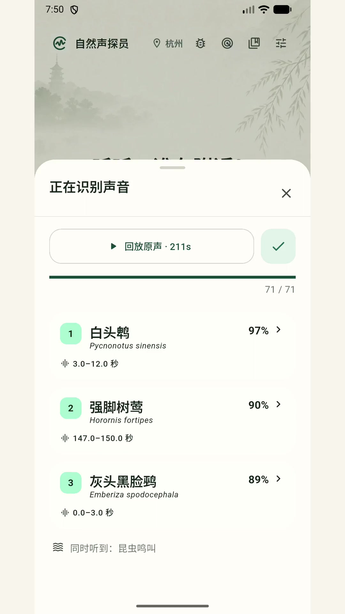
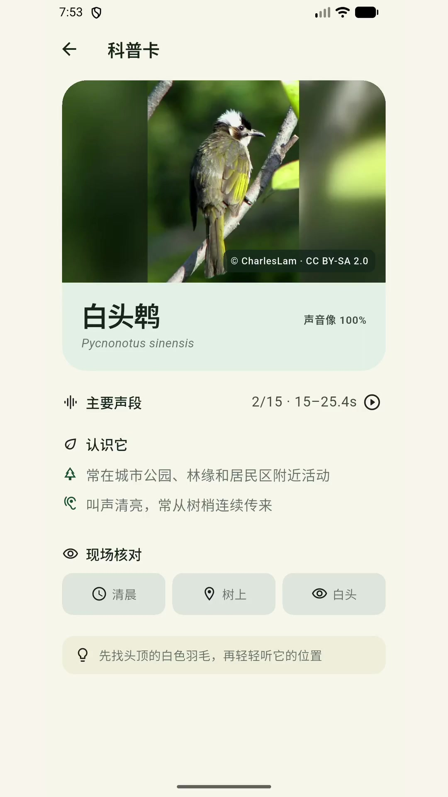
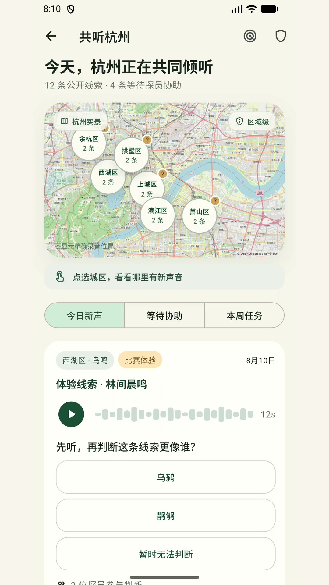
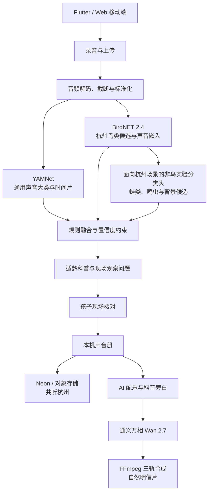

# 自然声探员

> 一个看不见的声音，如何变成孩子的自然调查？
> “小有可为”绿色发展赛道参赛项目说明书

---

## 1. 项目摘要

“自然声探员”是一款面向儿童及其家庭的 AI 自然调查产品。孩子可以在散步中录下鸟鸣、蛙声、虫鸣、流水、风雨等真实自然声音，系统通过多模型协作提出声音大类与物种候选，再将复杂的分析结果转化为儿童能够理解和执行的观察问题，引导孩子继续回听、观察、比较与现场求证。

产品不把“快速给出一个答案”作为终点，而是希望帮助孩子掌握一套探索自然的方法：**听见—记录—分析—观察—求证**。调查完成后，真实原声、时间、模糊地点和孩子的观察可以保存到声音册；经家长单独授权后，匿名声音线索还可以进入“共听杭州”，由其他自然声探员继续倾听和协助。孩子也可以邀请 AI 将真实原声与观察记录共创为一张自然明信片，让一次普通散步成为独一无二的童年自然记忆。

### 一句话定位

> 自然声探员，是一个从真实自然声音出发，连接家庭探索、AI 辅助与城市协作的儿童自然调查平台。

### 核心主张

> **候选，不是答案。AI 提供线索，孩子完成调查。**

### 核心用户

- 6—12 岁儿童及其家长；
- 开展自然观察活动的学校、教师和自然教育机构；
- 对城市自然声景和生物多样性感兴趣的公众参与者。

### 评委速览

| 评委关心的问题 | 自然声探员的回答 |
|---|---|
| 为谁解决什么问题 | 帮助家长把孩子对自然声音的好奇，转化为一次可以共同完成的自然调查 |
| 产品如何使用 | 录下原声，获得候选，回到现场观察与求证，再保存或经授权参与城市共听 |
| AI 做什么 | 理解复杂声景、发现候选、转译儿童调查问题，并在调查完成后参与自然明信片共创 |
| AI 不做什么 | 不把候选包装成答案，不替代儿童观察，不把生成画面作为物种证据 |
| 当前完成度 | Android 完整版、Web 展示版、魔搭创空间及声音分析、调查、声音册、城市共听和共创闭环均已实现 |
| 技术验证程度 | 已完成自动化回归、模型基线、性能测试和压力测试；杭州手机实录真值集与家庭可用性数据仍在补充 |
| 绿色发展价值 | 从亲子自然教育出发，降低公众参与城市生物多样性观察的门槛，并形成隐私保护的自然声音协作线索 |

---

## 2. 项目背景与用户问题

周末的公园里，孩子可能会突然停下来问：“妈妈，这段声音里，藏着什么？”

这类问题本身就是自然教育最珍贵的起点，但家长常常缺少相关知识和合适的引导工具。普通识别软件能够迅速给出一个名称，却也可能让探索在答案出现的一刻结束。对于孩子而言，真正有价值的不只是知道“它是什么”，而是学习怎样收集证据、怎样观察环境、怎样比较候选，以及怎样在暂时不能确定时保留不确定性。

### 2.1 家长面临的问题

- 希望孩子多接触自然，但不知道如何持续引导；
- 缺少物种和声景知识，难以回应孩子的现场问题；
- 普通散步容易变成走马观花，缺少共同任务；
- 识别工具往往直接给出结论，亲子讨论空间较少；
- 孩子的自然发现散落在相册和录音中，难以形成长期记录。

### 2.2 孩子面临的问题

- 听见声音，却不知道下一步应该观察什么；
- 面对专业名称、置信度和复杂声景时理解门槛较高；
- 容易把模型候选误认为确定答案；
- 一次识别结束后，缺少继续探索和再次参与的动力；
- 自己的发现难以与其他孩子产生联系。

### 2.3 项目机会

自然声探员希望把 AI 从“答案机器”变成“探索支架”：专用模型帮助发现候选，千问系列模型帮助理解复杂声景与组织调查线索，最终判断仍由孩子结合现场观察完成。

---

## 3. 产品定位与设计原则

### 3.1 产品定位

自然声探员不是只识别鸟类的工具，也不是单纯的儿童百科或 AI 图片生成器。它是一款以真实声音为证据、以儿童主动调查为核心、以家庭与城市协作为延伸的自然教育产品。

### 3.2 三项设计原则

#### 真实优先

保留真实原声、采集时间、经过模糊处理的位置和孩子自己的观察。AI 生成内容不替代真实证据。

#### 候选而非答案

所有机器标签均作为候选呈现。系统允许“无法判断”和“保留不确定”，避免把模型结果包装成确定事实。

#### AI 不替孩子作答

AI 将专业结果转化为儿童可以执行的问题，例如“声音来自树冠还是灌木”“节奏是否重复”。孩子通过现场观察决定是否确认、修改或暂不判断。

---

## 4. 典型使用故事

1. 孩子在杭州的公园中听见一段看不见的声音；
2. 打开自然声探员，录下最长 20 秒的真实原声；
3. 产品先检查录音是否足够清晰，避免在质量过低时强行判断；
4. 系统分析有效声段，提出自然声音大类、鸟类或其他声景候选；
5. AI 将候选和听觉依据转化为适龄的现场观察问题；
6. 孩子回听声音，观察树冠、灌木、水边、天气和时间；
7. 孩子比较候选，确认、修改或保留“不确定”；
8. 原声、时间、模糊地点和孩子的观察被保存到声音册；
9. 经家长单独授权后，匿名线索可以进入“共听杭州”；
10. 其他探员继续倾听、比较和协助；
11. 调查完成后，AI 将真实原声与观察共创为自然明信片；
12. 明信片可以留在自然册，也可以分享给家人。

---

## 5. 产品功能

### 5.1 自然声音采集

- 支持手机录音和常见音频文件上传；
- 单次录音最长 20 秒，上传文件不超过 15 MB；
- 提供录音反馈、原声回放和录音质量检查；
- 支持鸟鸣、蛙声、虫鸣、雨水、流水、风与树叶等多类声景；
- 嘈杂、混合或目标声音过远时，允许返回多个候选或“无法判断”。

### 5.2 有效声段与候选分析

- 将输入统一为单声道、16 kHz、16-bit PCM WAV；
- 分析主要声音及可能同时存在的其他声音；
- 提供候选声音类别、鸟种候选、对应时间片段和谨慎置信度；
- 使用杭州本地物种目录和地理先验缩小候选范围；
- 通过规则层过滤越界类别和过低置信度结果；
- 明确提示“候选不是答案”，避免误导儿童。

### 5.3 AI 调查线索转译

- 将专业模型结果转化为儿童可以理解的语言；
- 结合声音、时间、环境与候选，提出下一步观察问题；
- 引导孩子关注声音方向、重复节奏、树冠或灌木、水边等现场特征；
- 使用审核过的类别模板生成科普标题、解释、观察问题和安全提示；
- 支持结果纠错，让孩子和家长可以修正候选。

### 5.4 声音册与调查记录

- 保存真实原声及回放入口；
- 保存采集时间和经过模糊处理的位置；
- 保存候选、孩子的观察与判断；
- 保留尚未确定的部分，而不是强制选择答案；
- 在本机形成儿童和家庭的自然声音档案。

> 留下的不只是一次调查，更是孩子独一无二的自然记忆。

### 5.5 共听杭州

- 以杭州区域级声景地图呈现公开声音线索；
- 提供“今日新声”“等待协助”和任务入口；
- 支持其他探员继续倾听、比较候选和提交结构化协助；
- 只有经成年人单独授权的记录才能公开；
- 公开区域不包含精确坐标和儿童真实身份；
- 发布者可以撤回公开记录，相关公开音频同步删除。

### 5.6 AI 自然明信片

- 使用真实原声和孩子的观察作为创作起点；
- 通过 AI 生成配乐、儿童科普旁白和自然画面；
- 使用通义万相 Wan 2.7 生成自然主题视频画面；
- 使用 FFmpeg 合成原声、配乐、旁白与画面；
- 可保存到自然册或分享给家人；
- 明确标注 AI 生成内容；
- 生成内容仅作为调查完成后的创作表达，不作为识别证据。

### 5.7 体验与工程保障

- 异步分析任务与进度查询；
- 等待过程可取消，上次结果可恢复；
- 结构化日志、跨端 trace ID 与脱敏诊断导出；
- 录音默认保留不超过 24 小时，降低长期存储风险；
- 提供无模型示例和错误恢复，保障演示与弱网场景的可理解性。

### 5.8 关键功能实录

以下界面均截取自 Android 端真实使用录屏，呈现产品从声音分析、现场核对到城市协作的核心闭环。

| 声音候选分析 | 现场核对与科普卡 | 共听杭州 |
|---|---|---|
|  |  |  |
| 声学模型给出多个候选、对应声段与谨慎置信度 | 孩子结合时间、位置和环境特征完成现场求证 | 经家长授权的匿名线索进入区域级协作地图 |

---

## 6. 产品亮点

### 亮点一：从“识别答案”走向“儿童调查”

多数识别产品在名称出现时结束，自然声探员则从候选开始。产品持续引导孩子回听、观察、比较和求证，让 AI 成为科学探究过程的支架。

### 亮点二：从单一鸟类走向完整自然声景

项目不仅关注鸟鸣，也关注蛙声、鸣虫、流水、风雨等自然声音，并能识别人声、交通和机械噪声等干扰类别，帮助儿童理解自然环境由多种声音共同构成。

### 亮点三：从个人记录走向城市共听

经家长授权的匿名声音线索可以进入杭州区域级地图。其他探员能够继续倾听和提供结构化协助，让一次个人发现成为城市共同调查的一部分。

### 亮点四：从调查结果走向童年自然记忆

真实原声、时间、模糊地点、儿童观察和 AI 共创作品共同组成一份可长期保存的自然记忆，增强产品的情感价值和持续使用动力。

### 亮点五：多模型分工，而非单一模型包装全部能力

项目根据不同任务选择不同技术：千问负责复杂声景理解，BirdNET 负责鸟类候选，本地分类头补充蛙类和鸣虫，规则层约束输出，万相负责调查完成后的视觉共创。各模型职责清晰，生成内容与识别证据相互隔离。

---

## 7. 技术方案与特色

### 7.1 总体架构

### 7.2 音频预处理

系统将录音或上传音频截取至前 20 秒，并统一转换为单声道、16 kHz、16-bit PCM WAV。本地完整版通过 FFmpeg 再次解码、截断和标准化，保证不同手机和文件格式能够进入一致的分析流程。

当前系统没有接入盲源分离、目标声源提取或专用 AI 降噪模型。界面中的波形用于录音反馈和结果展示，并不是分类模型的直接输入。文档明确这一边界，避免夸大复杂混合声景下的识别能力。

### 7.3 YAMNet：本地通用声景候选

YAMNet 在本地处理16 kHz WAV，用于判断鸟类、蛙类、昆虫、雨水、流水、风与树叶、人声、脚步、交通或机械噪声等声音大类，并保留对应时间片。

正式分析链路不再调用通用音频多模态大模型。通用声景、专业候选与儿童观察通过确定性规则和共享调查状态组织，减少远程延迟、费用、隐私传输和模型冲突。

### 7.4 BirdNET 2.4：鸟类候选

本地完整版并行运行 BirdNET Acoustic 2.4。系统结合杭州坐标与全年地理先验，将 BirdNET 的 6,522 个输出范围缩小为 200 种杭州鸟类候选，并为结果提供时间片段与置信度参考。

当前规则要求 BirdNET 候选达到 `0.25` 才展示，达到 `0.5` 才能将鸟声线索提升为较高置信度。该结果仍是候选，需要结合现场观察核对。

### 7.5 面向杭州场景的非鸟实验分类头

项目复用 BirdNET 的 1,024 维声音嵌入，在不重复运行声学主干的前提下补充蛙类、鸣虫与背景候选。来源标签基线由 283 份独立来源录音、1,899 个三秒窗口建立，并按原始录音来源隔离训练、验证和测试集合。

比赛 Demo 已进一步接入十二分类实验头：覆盖赛事 9 个蛙虫物种，并设置 `other_insect`、`other_frog` 与 `background` 三个拒识或大类兜底类别。模型与类别元数据已同时安装到服务端和 Flutter，TFLite 文件哈希、输出顺序及 `[1, 1024] → [1, 12]` 张量契约通过跨端校验。

这一能力仍严格按照“实验候选”呈现：具体物种未达到阈值或缺少连续窗口支持时，自动退回“昆虫鸣叫”或“蛙类鸣叫”；现有来源标签、赛事标准声和合成压力集不能替代杭州公园手机实录真值集，也不能作为专家级物种鉴定结果。

### 7.6 规则融合与可信输出

- 过滤不在支持范围内的类别；
- 仅保留一个主要声音，将较弱线索放入“可能还听到”；
- 使用阈值约束低置信度候选；
- 将模型候选、儿童观察和最终确认区分存储；
- 使用审核模板生成适龄科普与安全提醒；
- 支持“无法判断”和人工纠错。

### 7.7 AI 共创链路

调查完成后，系统可以生成 AI 配乐和科普旁白，并使用通义万相 Wan 2.7 生成自然画面，最终通过 FFmpeg 将真实原声、配乐、旁白和画面合成为自然明信片。开发环境默认不调用付费视频接口，比赛演示可以复用已生成结果，只有最终验收时显式启用实时生成。

### 7.8 跨端与服务架构

| 层级 | 当前技术与职责 |
|---|---|
| 移动端 | Flutter，Android 优先并兼容后续 iOS；负责录音、调查、声音册和共听交互 |
| Web 展示端 | 浏览器录音与上传，提供快速体验入口 |
| 服务端 | Python、FastAPI；负责音频处理、异步任务、模型融合和结果接口 |
| 声学模型 | YAMNet、BirdNET 2.4 与面向杭州场景的十二分类非鸟实验头 |
| 调查编排 | 确定性融合、审核问题策略、共享调查状态与人类现场观察 |
| 共创模型 | 通义万相 Wan 2.7，以及 AI 配乐和科普旁白能力 |
| 数据库 | Neon PostgreSQL；承载“共听杭州”比赛 MVP 的结构化数据 |
| 媒体存储 | 本地开发存储或 S3 兼容对象存储 / Vercel Blob |
| 媒体合成 | FFmpeg，负责解码、标准化和自然明信片三轨合成 |
| 部署 | Android 完整版、Vercel Web 展示版与魔搭创空间分层部署 |

### 7.9 多端展示与能力边界

| 能力 | Android 完整版 | Vercel Web 展示版 | 魔搭创空间 |
|---|---|---|---|
| 通用声音候选 | YAMNet 本地推理 | 轻量YAMNet云端推理 | YAMNet 本地推理 |
| BirdNET 鸟类候选 | 支持 | 暂不支持 | 支持 |
| 杭州非鸟分类头 | 支持 | 暂不支持 | 支持 |
| 声音册与共听杭州 | 支持 | 支持浏览 | 聚焦单次分析 |
| AI 自然明信片 | 支持 | 暂不支持 | 暂不支持 |

Android 版用于演示完整调查与共创闭环；Vercel Web 版提供低门槛产品预览；魔搭创空间使用与 Android 端同源的本地声学模型，在 CPU 环境中提供最长 20 秒的声音候选分析。三个入口共享“候选不是答案”的产品原则。

### 7.10 能力成熟度与演示边界

| 能力 | 当前状态 | 对外呈现方式 |
|---|---|---|
| 手机录音、音质检查与回放 | 已实现并完成回归 | 可现场操作 |
| 鸟类候选与时间片段 | 已实现 | 明确标注为候选，允许无结果 |
| 蛙虫具体物种候选 | 已接入实验模型 | 仅展示通过阈值的实验线索，否则退回声音大类 |
| 儿童调查问题与现场核对 | 已实现 | 使用规则约束和审核模板，不直接展示自由生成故事 |
| 本机声音册与调查记录 | 已实现 | 可现场保存、回放和删除 |
| 共听杭州 | 比赛 MVP 已实现 | 只有经家长单独授权的匿名线索才能公开 |
| AI 自然明信片 | 完整链路已跑通 | 比赛演示优先复用已生成结果，避免现场生成波动 |
| 杭州现场识别准确率 | 尚未形成正式结论 | 待人工确认的杭州手机实录测试集完成后报告 |
| 家庭教育效果 | 尚未形成量化结论 | 待小规模家庭可用性测试与后续试点验证 |

---

## 8. 儿童安全、隐私与可信 AI

### 8.1 家长授权与公开边界

- 私人声音册与公开声音线索相互分离；
- 只有经成年人单独授权的记录才能进入“共听杭州”；
- 应用不会默认把儿童记录公开；
- 发布者可以随时撤回记录。

### 8.2 位置与身份保护

- 公开页面仅展示区域级模糊位置，不公开精确坐标；
- 应用使用本机随机 ID 换取服务端签名的匿名 Token；
- 发布者与协助者身份由 Token 判断，不信任客户端自行提交的身份字段；
- 公开信息不包含儿童真实姓名、人脸或直接身份信息。

### 8.3 媒体与数据保护

- 原录音默认保留不超过 24 小时；
- 撤回公开记录时同步删除对象存储中的短音频；
- 对象存储配置不完整时，服务端拒绝启动，避免误写临时磁盘；
- 日志使用脱敏字段与跨端 trace ID，不记录密钥和敏感身份信息。

### 8.4 可信 AI 边界

- 所有机器标签均明确标记为候选；
- 不把 AI 生成画面当作物种确认依据；
- 不将未经约束的大模型故事直接展示给儿童；
- 允许儿童和家长纠错或选择“暂时无法判断”；
- 安全提示通过审核模板输出，避免鼓励儿童接近危险动物或区域。

---

## 9. 当前实现与验证基础

### 9.1 已完成的工程基础

- 使用 Python 3.11 和 `uv` 管理服务端与模型环境；
- 建立 76 条录音的本地人工复核工具；
- 完成 BirdNET 2.4 第二阶段基线；
- 接入杭州 200 种鸟类目录；
- 完成 5 类来源标签非鸟基线，并在比赛 Demo 中训练、安装十二分类非鸟实验头；
- 从源录音生成 142 个三秒候选片段，并按源录音隔离训练、验证和测试集合；
- 跑通YAMNet、BirdNET、非鸟分类头与规则融合的本地亲子识别链路；
- 完成录音质量检查、结果纠错、本机声音册和错误恢复；
- 跑通 AI 配乐、科普旁白、万相画面和 FFmpeg 合成闭环；
- 完成 Web、Flutter、Android 原生层与 Python 服务端的结构化日志；
- 接入 Neon 的“共听杭州”比赛 MVP。

### 9.2 当前验证边界

所有机器标签均为候选标签。未经人工试听确认的数据不能作为正式测试集。现阶段的非鸟分类头主要基于来源标签、赛事标准声覆盖检查和合成压力测试，仍需继续建立杭州公园人工听审测试集。

项目目前证明了完整产品闭环和工程可行性，但尚不使用未经验证的数据宣称大规模识别准确率、用户增长或教育效果。后续将通过家庭可用性测试、学校活动试点和专家听审逐步建立量化证据。

### 9.3 已完成的量化验证与待补证据

#### 9.3.1 工程与产品回归

| 验证项目 | 当前结果 | 结论边界 |
|---|---:|---|
| Python 自动化测试 | 75 项通过 | 覆盖当前服务端、模型接入与核心业务回归 |
| Flutter 自动化测试 | 44 项通过 | 覆盖当前移动端核心逻辑；`flutter analyze` 无问题 |
| Android 交付 | arm64 Release APK 构建成功 | APK 为 51,655,028 字节，约 49.3 MiB，包含本地模型 |
| 跨端模型契约 | 校验通过 | 服务端与移动端的 TFLite 哈希、12 类输出顺序及 `[1, 1024] → [1, 12]` 张量契约一致 |
| Web 响应式布局 | 360 px、390 px 与 1,280 px 均通过 | 本次真实 Chromium 回归中无横向溢出 |
| 浏览器运行质量 | 控制台 0 错误、0 警告 | 仅代表该次本地真实回归环境 |
| 产品关键闭环 | 录音、音质检查、真实分析、纠错、声音册、回放、删除和重启恢复均通过 | 证明流程与数据恢复可运行，不代表家庭可用性结论 |

#### 9.3.2 模型、性能与稳定性验证

| 验证项目 | 当前结果 | 结论边界 |
|---|---:|---|
| 鸟类官方标准声覆盖 | 阈值 0.25 与 0.50 下目标召回均为 83.33% | 面向赛事官方标准声，不代表杭州现场准确率 |
| 鸟类产品链路探索结果 | 7 条核心鸟类弱标签录音中命中 4 条，探索性召回 57.1% | 产品只分析前 20 秒，且文件名是弱标签，不能称为正式准确率 |
| 蛙虫独立官方检查 | 14 个声源、116 个窗口；声源级召回 78.57%，宏平均 F1 为 0.6309 | 官方标准声未进入训练，但结果仍不代表杭州公园泛化能力 |
| 推理重复确定性 | 同一批 116 个窗口连续推理 10 次，最大概率漂移为 0，窗口决策一致率为 100% | 仅证明当前 CPU 环境重复运行稳定，不代表跨手机一致性 |
| 压力测试规模 | 419 份录音、2,838 个三秒窗口 | 覆盖不同信噪比、增益、时间偏移、混响、手机频响、重采样和量化 |
| 独立纯背景误报 | 30 个窗口中具体物种误报率为 0 | 仅限当前压力集，不能外推到所有户外环境 |
| 3 / 10 / 20 秒本地声学链路 | 约 0.149 / 0.345 / 0.509 秒 | 当前 Windows CPU、模型已预加载，不包含远程千问声景解释 |
| 20 秒逐窗阶段更新 | 约 1.76 秒完成 7 次进度更新 | 为提供渐进反馈牺牲部分吞吐量，仍不包含远程模型耗时 |
| 来源标签训练基础 | 283 份独立来源录音、1,899 个三秒窗口 | 衡量来源标签拟合能力，不是杭州人工真值集 |
| 数据隔离 | 28 个源录音组，训练 66 段、验证 37 段、测试 39 段，跨集合泄漏为 0 | 证明当前切片按源录音隔离，不等于数据规模充分 |

压力测试显示，模型在时间偏移、轻度量化和较高信噪比条件下相对稳定，而在手机频响、16 kHz 重采样和低信噪比条件下明显退化；当信噪比降至 -5 dB 时，九个具体蛙虫物种的宏平均 F1 降至 0.3950。产品因此采用精确率优先阈值、背景门控、嵌入距离和连续窗口支持进行四层拒识，并允许系统放弃判断。

上述数据来自仓库内可复现的基线、回归与压力测试记录。它们证明当前工程链路、标准声覆盖和特定测试条件下的性能，不应被改写为真实公园环境的综合识别准确率。

#### 9.3.3 下一阶段真实用户与现场验证

| 待验证指标 | 目的 | 计划口径 |
|---|---|---|
| 测试家庭数量与儿童年龄 | 说明目标用户覆盖 | 按家庭、年龄段和设备记录，不以内部演示人数代替 |
| 一次调查完成率 | 验证完整流程是否可理解 | 从开始录音到完成至少一项人工观察 |
| 录音质量通过率 | 验证户外采集可用性 | 分设备、环境和失败原因统计 |
| 儿童主动回听比例 | 验证调查行为是否发生 | 记录候选出现后是否主动回听原声 |
| 候选后现场观察比例 | 验证 AI 是否推动探索 | 记录是否补充至少一项来自现场的人类证据 |
| 家长教育价值评分 | 验证家庭价值 | 同时收集开放反馈和继续使用意愿 |
| 杭州手机实录候选命中情况 | 验证真实场景声学表现 | 使用人工听审、按地点与日期隔离的独立测试集 |
| Android 真机性能 | 验证端侧可用性 | 分设备记录延迟、峰值内存、功耗和失败率 |

---

## 10. 应用价值

### 10.1 家庭价值

- 降低家长开展自然教育的知识门槛；
- 为亲子散步增加共同倾听和讨论的任务；
- 将零散录音转化为可回顾的儿童成长记录；
- 让家长看到孩子如何观察、比较和形成判断。

### 10.2 教育价值

- 培养倾听、记录、观察、比较和求证能力；
- 将科学探究方法融入日常生活；
- 让儿童理解模型结果具有不确定性；
- 将 AI 从“替代思考”转变为“支持思考”。

### 10.3 社会价值

- 提升儿童家庭对城市生物多样性的关注；
- 形成经过隐私保护的公众自然声音线索；
- 为公园、学校和自然教育机构提供低门槛参与入口；
- 逐步形成儿童参与的城市自然声音协作网络。

### 10.4 对绿色发展赛道的响应

自然声探员对绿色发展的理解，不是只在产品中加入自然图片或环保口号，而是通过数字技术改变儿童家庭认识和参与城市生态的方式：

1. **让自然教育发生在日常生活中。** 产品以公园散步和社区户外活动为入口，不要求家庭先具备专业物种知识，降低接触自然、理解声景和持续观察的门槛。
2. **让 AI 推动真实观察，而不是替代自然体验。** 模型只提供候选与线索，产品必须把儿童重新带回回听、观察、比较和求证，避免屏幕中的答案取代户外体验。
3. **让个人发现形成城市协作。** 经家长授权和隐私处理后，分散在不同家庭中的声音线索可以进入“共听杭州”，由更多儿童和公众协助倾听，逐步形成区域级自然声景关注网络。
4. **让不确定性得到负责任的表达。** 公开记录保留来源、模型版本、人工观察和审核状态；未经人工确认的线索不能直接成为科研结论、训练数据或确定性生态记录。
5. **为学校、公园和自然教育机构提供可扩展入口。** 后续可以围绕校园、公园路线和季节性声景设计任务，在保护儿童身份与敏感物种位置的前提下服务公众自然教育。

项目当前首先验证的是教育参与和协作机制，而不是宣称已经形成大规模生态监测网络。只有经过规范授权、人工复核和数据质量控制的记录，才可能进一步服务长期生物多样性观察。

---

## 11. 产品差异化与竞品调研

本节不以抽象的“识别工具”或“自然教育产品”代替竞品，而是选取截至 2026 年 8 月仍可查证、且分别代表声音识别、儿童自然探索和公众协作的具体产品。比较依据为产品官方介绍与帮助文档，重点考察“产品帮助用户完成什么任务”，而不是仅比较模型数量或物种覆盖规模。

### 11.1 代表产品及核心闭环

**Merlin Bird ID。** 康奈尔鸟类学实验室推出的鸟类识别与学习工具，支持声音、照片和问答等识别方式；Sound ID 可离线工作，并结合照片、鸣声、分布信息和 eBird 观察数据帮助用户了解鸟类。其核心闭环是“听见或看见鸟—快速识别—查看鸟种资料与个人记录”，专业鸟类资源和即时反馈能力成熟。

**BirdNET。** 康奈尔鸟类学实验室与开姆尼茨工业大学共同推进的鸟声识别体系。移动端允许用户录制数秒声音并获得鸟种识别建议，核心任务集中在鸟类声学检测与候选输出，是本项目鸟类候选能力的重要技术参照，而不是儿童调查流程的直接竞品。

**懂鸟。** 面向中文观鸟用户的本土产品，提供鸟类图片、鸣声识别和资料查询，并推出强调离线使用的 Android 版本。它降低了中文用户识鸟与查阅鸟类资料的门槛，其主要价值仍集中在“识别鸟类与获取鸟类知识”。

**Seek by iNaturalist。** 面向家庭和年轻自然探索者，使用视觉识别帮助用户发现动植物，并通过挑战、徽章等机制鼓励户外探索。Seek 对位置隐私的处理尤其值得借鉴：产品会使用大致区域辅助物种建议，但不会保存或发送用户的精确位置。它证明了“儿童友好、即时反馈和隐私保护”可以同时成立。

**iNaturalist。** 面向广泛自然观察者的公众科学平台，兼具物种观察记录、自动化识别建议和社区共同鉴定。其核心闭环是“提交可观察的生物记录—获得识别建议—由社区补充或修正鉴定—形成可复用的观察数据”，社区协作与数据沉淀机制成熟。

**eBird。** 面向观鸟者与科研、教育和保护工作者的鸟类观察记录平台。移动端以观察清单、时间、地点、路线和数量记录为核心，并将符合规范的数据用于研究、教育与保护。它体现了从个人观察走向长期数据价值所需的记录规范，但并不是为低龄儿童独立使用而设计。

### 11.2 基于真实产品的对比

| 产品 | 已验证的核心能力 | 产品主要闭环 | 与自然声探员的关系 |
|---|---|---|---|
| Merlin Bird ID | 鸟鸣、照片和问答识鸟；鸟类资料；离线 Sound ID | 识别鸟类并继续了解鸟种 | 鸟类识别体验成熟；自然声探员不以超越其识别规模为目标，而把候选继续转化为儿童调查 |
| BirdNET | 录音、声段分析与鸟类识别建议 | 从声音获得鸟种候选 | 是鸟类声学能力参照；自然声探员在其后增加环境声理解、现场核对、儿童表达和记录闭环 |
| 懂鸟 | 中文鸟类图片、鸣声识别与资料查询 | 识鸟与鸟类知识查询 | 本土化识鸟工具；自然声探员覆盖的任务对象还包括蛙、鸣虫、流水、风雨及城市环境声 |
| Seek | 视觉识别、挑战、徽章与精确位置保护 | 发现物种并完成探索挑战 | 儿童友好机制的重要参照；自然声探员以听觉为入口，并强调亲子求证和声音记忆 |
| iNaturalist | 观察上传、自动建议和社区鉴定 | 个人观察进入公众协作 | 社区鉴定体系成熟；自然声探员将协作范围收敛为家长授权的区域共听，并降低儿童表达门槛 |
| eBird | 鸟类清单、时间地点、轨迹和规范化数据提交 | 个人观鸟记录进入长期数据库 | 科学记录规范的重要参照；自然声探员当前首先验证儿童教育与家庭协作，不把未经复核的线索直接表述为科研数据 |

### 11.3 自然声探员的差异化结论

调研表明，现有产品已经分别很好地解决了鸟类识别、自然观察、儿童探索或公众协作问题。自然声探员不宣称替代这些专业平台，而是聚焦它们之间尚未被完整连接的儿童声音调查环节。

1. **差异不在“更快给答案”，而在“答案之后仍有行动”。** 产品以多个候选和对应声段为起点，引导孩子回听、观察、比较和求证，避免把模型结果直接包装成确定事实。
2. **差异不在“只识别更多物种”，而在“理解完整声景”。** 除鸟类外，产品还关注蛙类、鸣虫、流水、风雨以及人声、交通和机械噪声，让孩子理解自然环境由生物声、自然过程声和人为声音共同构成。
3. **差异不在“增加社区功能”，而在“为儿童重新设计协作边界”。** 未确定的声音可在家长授权后以匿名、模糊位置的方式进入区域共听，其他探员继续倾听和提供结构化协助。
4. **差异不在“调用生成式 AI”，而在“让共创建立在真实调查上”。** AI 只在保留原声、时间、模糊地点和儿童观察之后参与科普表达与视觉共创，生成内容与识别证据保持分离。
5. **差异不在“保存一次结果”，而在“保存孩子的童年独家记忆”。** 声音册记录的不只是物种名称，还包括孩子当时听见了什么、如何观察、怎样与家长讨论，以及最终形成的自然明信片。

因此，自然声探员的一句话差异化可以概括为：**它不是替孩子认出声音的工具，而是一套从真实原声出发，让孩子借助 AI、现场观察和城市协作完成自然调查的产品系统。**

### 11.4 调研来源与评价边界

- Merlin Bird ID 官方介绍：<https://merlin.allaboutbirds.org/>
- Merlin Sound ID 官方帮助：<https://support.ebird.org/en/support/solutions/articles/48001185783-sound-id>
- BirdNET App 官方介绍：<https://birdnet.cornell.edu/app/>
- 懂鸟官方网站：<https://aboutbirds.app/>
- Seek by iNaturalist 官方介绍：<https://www.inaturalist.org/pages/seek_app>
- iNaturalist 官方说明：<https://www.inaturalist.org/pages/about>
- eBird Mobile 官方说明：<https://support.ebird.org/en/support/solutions/articles/48000957940>

以上对比基于公开功能和产品任务，不对各产品未公开的算法、运营数据或未来规划作推断；“未突出某项能力”也不等同于“完全不具备该能力”。

---

## 12. 落地路径与发展规划

### 第一阶段：完善杭州家庭调查闭环

- 完善杭州本地声景与常见物种候选；
- 建立杭州公园人工听审测试集；
- 开展小规模家庭可用性测试；
- 优化录音质量提示、调查问题和声音册体验。

### 第二阶段：进入学校与自然教育活动

- 增加班级任务、教师端和班级声音册；
- 提供适龄调查模板和活动路线；
- 与公园、学校和自然教育机构开展试点；
- 形成可复用的课程与活动评估方法。

### 第三阶段：拓展城市协作网络

- 将“共听杭州”扩展到更多城区和城市；
- 引入专家或志愿者协助机制；
- 建立长期声景观察任务；
- 在严格隐私和数据质量控制下服务公众自然教育。

### 可探索的业务模式

- 家庭会员：家庭声音册、长期自然报告和更多共创能力；
- 学校与机构服务：班级任务、活动管理和成果展示；
- 公园合作：定制声景路线、自然任务和公众参与活动；
- 公益合作：城市生物多样性教育和儿童科学素养项目。

上述模式属于发展方向，当前项目重点仍是完成比赛 MVP 与真实用户验证。

---

## 13. 团队信息

- **团队成员：**葛庆宇、梁皓宇
- **所属单位：**中国科学院西双版纳热带植物园

---

## 14. 项目体验与材料索引

- **GitHub 开源项目：**<https://github.com/gqy20/nature-sound-detective>
- **魔搭创空间：**<https://modelscope.cn/studios/gqy2025/nature-sound-detective>
- **Web 产品展示：**<https://listen.gqy20.top/>
- **Android 安装包：**<https://github.com/gqy20/nature-sound-detective/releases/tag/0.1.0>

---

## 15. 结语

自然声探员希望解决的，不只是“这个声音是什么”，而是“孩子怎样从一段看不见的声音出发，完成一次真实的自然调查”。

专用声学模型帮助发现候选，千问系列模型帮助理解和转译线索，万相帮助把调查转化为可以保存和分享的自然作品；但真正完成观察、比较和求证的，始终是孩子自己。

> 每一个孩子，都是自然声探员。

---

## 附录 A：正式提交前检查项

1. 官方 Logo 使用规范；
2. 真实用户访谈或小规模可用性测试数据；
3. 产品二维码与现场演示说明；
4. 杭州手机实录真值测试集与人工听审结果；
5. 开源模型、公开音频与视觉素材的许可说明；
6. 联系人及联系方式。

## 附录 B：量化证据索引

| 证据主题 | 本地文档 |
|---|---|
| BirdNET 首轮与第二阶段弱标签基线 | `docs/06-BirdNET基线测试记录.md`、`docs/08-stage2-unified-review-and-baseline.md` |
| Web 真实模型与产品回归 | `docs/15-真实回归测试报告.md` |
| 杭州自然声正式评测口径 | `docs/16-杭州自然声识别评测实施.md` |
| 非鸟模型数据、性能与拒识策略 | `docs/20-多类群声学识别接入.md` |
| 赛事标准声、压力测试与自动化回归 | `docs/21-2026挑战数据基线.md` |
| 非鸟分类头 v0.3 逐类指标与移动端集成 | `docs/nonbird-v0.3-evaluation.md` |

这些材料保留了测试日期、样本条件、指标解释和能力边界。正式提交版本可将其中最关键的机器可读报告、测试日志和截图整理为附件，不需要把所有实验细节堆叠在正文中。

## 附录 C：官方要求覆盖检查

| 官方要求 | 对应章节 |
|---|---|
| 产品简介 | 第 1—4 章 |
| 产品功能 | 第 5 章 |
| 产品亮点 | 第 6 章 |
| 技术方案特色 | 第 7 章 |
| 完整项目说明 | 第 8—15 章及附录 |
