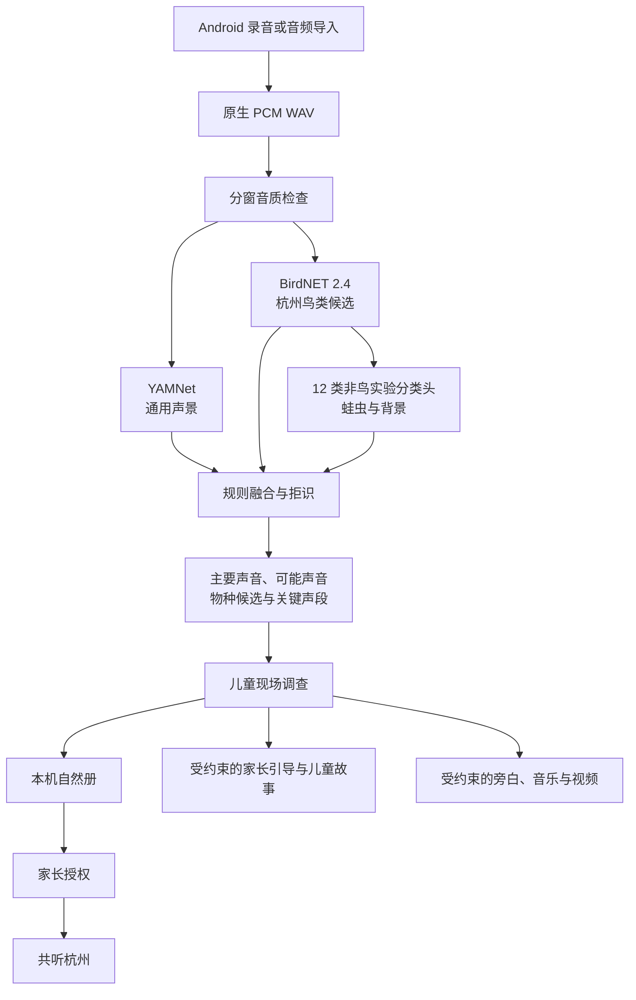

# 自然声探员

> 一个看不见的声音，如何变成孩子的自然调查？  
> “小有可为”绿色发展赛道决赛参赛项目说明书  
> 文档版本：v0.2 工作稿  
> 状态基准：2026-09-02，Git HEAD `76547e2` 及当前未提交工作区  
> 已发布移动端版本：`0.4.1+4002`（Git Tag `0.4.1`）

---

## 1. 项目摘要

“自然声探员”是一款面向城市儿童与家庭的 AI 自然调查应用。孩子在公园、社区或校园中录下最长 20 秒的鸟鸣、蛙声、虫鸣、流水、风雨等真实自然声音，系统先检查证据质量，再通过端侧多模型分工提出声音大类和物种候选。候选出现后，产品不以“给出答案”结束体验，而是引导孩子回听关键声段，继续记录时间、生境、活动、声音规律和外形等现场证据。

家长可以通过家长模式或两台设备的 6 位连接码参与同一次探索，查看结构化进展，发送共同观察任务，并获得“可以说、一起做、需要避免”的陪伴建议。调查完成后，真实原声、候选、现场观察和路线上下文进入本机自然册；在家长单独授权后，匿名线索才可进入“共听杭州”。孩子还可以基于本次真实观察生成动物故事、科普旁白、自然配乐和短片，让一次散步成为可回顾的家庭自然记忆。

### 1.1 一句话定位

> 自然声探员不是替孩子认出声音的工具，而是一套从真实原声出发的儿童自然调查系统。

### 1.2 核心主张

> **候选，不是答案。AI 提供线索，孩子完成调查。**

### 1.3 核心用户

- 6—12 岁儿童及其家长；
- 组织校园、研学和自然教育活动的教师与机构；
- 对城市自然声景和生物多样性感兴趣的公众参与者。

### 1.4 评委速览

| 评委关心的问题 | 自然声探员的回答 |
|---|---|
| 为谁解决什么问题 | 帮助家长把孩子对自然声音的好奇，转化为一次可以共同完成的自然调查 |
| 产品如何使用 | 选择公园与路线、录下原声、获得候选、回听与现场观察，再保存、创作或经授权进入城市共听 |
| AI 做什么 | 端侧声学模型提出候选；生成模型在证据之后组织家长引导、儿童故事与自然作品 |
| AI 不做什么 | 不把候选包装成确定答案，不替代儿童观察，不让生成内容修改声学证据 |
| 当前完成度 | Android 端侧调查、亲子双模式、亲子游园指南、自然册、共听杭州、故事与影音创作已实现；Web 和魔搭创空间提供降低体验门槛的展示入口 |
| 当前验证程度 | Python 180 项测试通过；Flutter 静态分析 0 问题，179 项移动端测试通过；最新 `make verify` 通过 |
| 当前证据边界 | 实体 Android 手机户外家庭测试、三公园真实观察规模和杭州蛙虫真值仍需补充 |

---

## 2. 项目背景与用户问题

周末的公园里，孩子可能会突然停下来问：“这是什么声音？”他能听见，却常常看不见声音的来源。

这类问题是自然教育的珍贵起点，但家长往往不认识相关物种，也不知道下一步该问什么。普通识别工具可能快速给出一个名称，但一个答案出现后，观察也可能随之结束。孩子并不知道证据在哪里、为什么仍然不确定、自己还能观察什么。

自然声探员因此把问题从“如何更快识别一个声音”改写为：

> 如何用最小的证据成本，帮助孩子完成一次可追溯、可修正、可继续生长的自然调查？

### 2.1 家长面临的问题

- 愿意陪孩子走进自然，却缺少可以当场使用的提问和观察方法；
- 担心说错物种，也担心把 AI 的候选当成结论；
- 普通散步容易走马观花，缺少家庭可共同完成的任务；
- 孩子的录音、照片和想法分散存放，难以形成长期记忆。

### 2.2 孩子面临的问题

- 听见声音，却不知道下一步要看什么、听什么；
- 面对专业名称、分数和复杂声景时理解门槛高；
- 容易把机器候选当成唯一正确答案；
- 一次识别结束后，缺少回听、再次观察和继续记录的动力。

### 2.3 产品机会

将 AI 从“答案机器”转化为“探索支架”：专用声学模型帮助发现候选，确定性规则保留证据来源和不确定性，生成模型只在证据之后帮助家长陪伴、帮助孩子表达和创作。

---

## 3. 产品定位与设计原则

### 3.1 三个角色的权责分工

| 角色 | 拥有的权利与责任 |
|---|---|
| 孩子 | 拥有探索权和判断权，可以确认、纠正，也可以选择“暂时不知道” |
| 家长 | 拥有陪伴权、安全边界权和公开决定权 |
| AI | 只拥有检查证据、提出候选和给出建议的权力，不拥有最终确认权 |

### 3.2 四项设计原则

#### 真实优先

保留真实原声、录制时间、区域级地点和孩子自己的观察。AI 生成的图像、音乐和视频不替代真实证据。

#### 候选而非答案

所有机器标签均作为候选呈现。系统允许“无法判断”和“保留不确定”，不把低质量录音强行输出为具体物种。

#### AI 不替孩子作答

AI 将专业结果转化为儿童可以执行的观察问题。孩子在现场完成观察，而不是在屏幕中接受一个权威答案。

#### 联网能力可失败

本地录音、音质检查、端侧识别、回听和现场观察是主流程；社区、家庭同步和生成内容是可选联网能力。网络或模型访问失败时，调查仍能继续。

---

## 4. 一个家庭怎样完成一次自然声音调查

### 4.1 出发前：选择公园与路线

家长在“亲子游园指南”中先选择杭州植物园、西溪湿地或太子湾公园，再填写孩子年龄、可用时间、声音兴趣、步行偏好和无障碍需求。系统提供路线时长、适龄说明、安全提示和站点任务。社区真实数据不足时，推荐只表达“很适合、比较适合、可以尝试”，不使用“动物最多”或“一定能遇见”。

### 4.2 到达站点：录下真实原声

孩子点击路线站点中的“到这里开始聆听”，录下最长 20 秒的现场声音。录音保留公园、公开分区、路线和站点上下文，但不记录儿童行动轨迹和精确录音坐标。

录音时的声纹由 Android PCM 实时 RMS 和 Peak 数据驱动，分析阶段读取录音文件的真实包络，回放阶段按播放器真实位置推进；静音与暂停时不制造虚假波动。

### 4.3 分析前：先判断证据是否可用

系统按时间窗口检查录音，避免整段平均音量把短暂叫声稀释掉。

| 录音状态 | 产品行为 | 是否可进入生态趋势 |
|---|---|---|
| 清晰声音 | 进入正常分析 | 满足其他条件时可以 |
| 弱但有动态峰值 | 允许谨慎探索，显示弱声边界 | 不可以 |
| 静音或无有效信号 | 说明原因并建议重录 | 不可以 |

### 4.4 候选出现：回听、观察和求证

系统展示主要声音、可能声音、杭州物种候选、模型来源和关键声段。孩子继续补充五类观察：

- 时间：什么时候听见；
- 生境：树冠、灌木、林下、水边或开阔地；
- 活动：独自、成群、飞行或隐藏；
- 声音：连续、间隔、重复或突发；
- 外形：只在真正看见时记录。

孩子可以确认、纠正，也可以选择“暂时不知道”。候选不会因为生成内容的叙述而自动升级为确认物种。

### 4.5 调查进行中：家长在关键时刻参与

两台设备通过 6 位连接码建立临时家庭探索。儿童端同步的是录音、回听、观察和任务完成等结构化事件，而不是儿童身份、原始录音或精确位置。

家长端可以：

- 查看孩子已完成的探索步骤；
- 发送一项共同观察任务；
- 查看任务已送达、已接收、已完成等状态；
- 获得 2—3 个“可以说、一起做、需要避免”的引导方向；
- 获得 3—5 条基于孩子本次真实行为的可选回应。

例如，“你没有急着猜答案，而是先听出了它重复的节奏”。最后真正说出口的仍然是爸爸妈妈，AI 只提供备选建议。

### 4.6 完成调查：保存、创作与城市共听

调查记录默认保存在本机自然册。至少完成两个有效观察维度后，孩子可以选择候选动物，生成关于“它怎样生活”或“它为什么发声”的故事。故事必须使用孩子本次的真实观察，并显示“AI 基于候选信息创作，不代表已经确认物种”。

作品创作将真实原声、科普旁白、AI 自然配乐和无声自然画面进行本机合成。任务中断后可以从作品册继续；音乐权限不可用时，系统可跳过配乐继续完成其他阶段。

只有家长完成独立授权后，匿名探索卡才能进入“共听杭州”。公开页只使用城区、公园和公开分区坐标，不包含儿童精确位置。

---

## 5. 产品功能与当前实现

| 产品模块 | 已实现能力 | 当前边界 |
|---|---|---|
| 自然声采集 | Android 原生麦克风录音、真实 RMS/Peak 反馈、文件导入、最长 20 秒 | 实体手机户外信噪比与设备差异仍需继续验收 |
| 音质分层 | 清晰、弱动态、无效录音分层，加入削波检查 | 弱声可用于教育调查，不进入生态趋势 |
| 本地候选分析 | YAMNet、BirdNET 2.4、12 类非鸟实验分类头和确定性规则融合 | 物种级结果是候选，非杭州现场综合准确率 |
| 现场调查 | 关键声段回听、五类观察、确认/纠正/暂不判断、调查状态保存 | 当前为决赛最小一轮调查，不声称已完成自动多轮候选重排 |
| 儿童/家长双模式 | 角色化首页、6 位连接码、结构化进展、共同任务和过程反馈 | 当前为匿名临时家庭会话，尚无完整家庭账户系统 |
| 亲子游园指南 | 三公园、公开分区、家庭条件筛选、路线和站点聆听入口 | 当前依赖审核过的路线内容，不做基于儿童精确位置的自动导航 |
| 自然册与作品册 | 保存原声、候选、观察、路线上下文，保存和恢复创作任务 | 当前以本机保存为主 |
| 共听杭州 | 原生高德动态地图、区域声景、真实/体验数据区分、音频播放、结构化协助和撤回 | 三公园当前主要使用透明标记的体验数据，不用于提高真实数据充分度 |
| 儿童故事 | 完成至少两个观察维度后生成，校验候选边界和真实观察引用 | 模型失败或校验失败时回退到本地安全模板 |
| 影音创作 | Fun-Music、Qwen-Audio TTS、Wan 3.0 Video 与本地合成，支持中断恢复 | 属于可选联网创作，不参与声学识别和物种确认 |
| 多端体验 | Android 完整版、Web 展示版、ModelScope CPU 在线参考实现 | 不同端的运行边界不同，不宣称线上轻量版等同 Android 完整版 |

---

## 6. 产品亮点与创新性

### 6.1 从“一键识别”走向“儿童调查”

识别只是调查的中间步骤。系统必须先说明声音是否可用，再展示候选与关键声段，并把孩子带回回听和现场观察。产品价值不是缩短到答案的距离，而是帮助孩子建立从证据到判断的方法。

### 6.2 儿童、家长和 AI 的权责分工

孩子拥有判断权，家长拥有陪伴权、安全边界权与公开决定权，AI 只有建议权。产品不是用 AI 代替家长陪伴，而是把孩子已经发生的真实行为转化为家长可以使用的引导和回应。

### 6.3 从“一次录音”走向“家庭自然记忆”

自然册保留原声、候选、现场观察和路线上下文，作品册保留 AI 故事、旁白、音乐和短片。可回顾的不只是物种名称，还有孩子当时怎样听、怎样观察、怎样与家长一起接近答案。

### 6.4 从“个人记录”走向“城市共听”

家庭记录默认私人。经家长独立授权后，匿名线索可以以区域坐标进入“共听杭州”，由其他参与者继续倾听和补充结构化协助。真实观察、AI 作品和体验示例在数据层显式区分。

### 6.5 识别证据与生成内容严格分离

本地声学模型负责候选和关键声段；文本、语音、音乐和视频模型在之后负责陪伴、表达和创作。生成模型不能改写候选，原始自然声不作为通用大模型物种判断的输入。

---

## 7. AI 与技术方案

### 7.1 总体架构

### 7.2 音频与音质处理

Android 原生录音以 PCM WAV 保存声音，并为不同模型准备所需采样率。音质层使用分窗 RMS、Peak 与削波比例，区分清晰、弱动态和无效录音。这一分层同时服务两个目标：允许孩子在弱声条件下继续教育探索，又防止低质量数据进入城市生态趋势。

### 7.3 端侧多模型证据

- **YAMNet：**判断鸟类、蛙类、昆虫、流水、风雨、人声、交通和机械等通用声景类别；
- **BirdNET 2.4：**从鸟声中提出物种候选，并结合杭州地理先验将输出缩小到 200 种本地候选；
- **12 类非鸟实验分类头：**复用 BirdNET 嵌入，补充蛙类、鸣虫和背景候选；
- **规则融合：**保留模型来源、时间片和候选状态，通过阈值、背景门控、候选间隔、嵌入距离和连续窗口支持进行谨慎输出。

不同模型的分数不被简单平均。当物种证据不足时，系统回退为“鸟类鸣叫”等更安全的大类，或直接返回“暂时无法判断”。

### 7.4 生成模型在证据之后工作

| 环节 | 输入 | 当前默认能力 | 输出与边界 |
|---|---|---|---|
| 家长陪伴 | 候选、声音大类、弱声标记、现场观察和真实行为 ID | 千问文本生成 | 2—3 个引导方向和 3—5 条基于真实行为的回应；失败时回退本地模板 |
| 儿童故事 | 候选、区域、故事角度和至少两项现场观察 | 千问文本生成 | 基于本次观察的短故事；不得将候选写成确认物种 |
| 自然配乐 | 声音大类和受控文字提示 | Fun-Music | 无人声背景音乐；权限不可用时可跳过 |
| 科普旁白 | 受控的候选与观察摘要 | Qwen-Audio TTS | 较慢语速的旁白；失败不阻断其他素材 |
| 竖屏短片 | 候选状态、环境、观察摘要和负面提示 | Wan 3.0 Video | 无声自然画面；不作为物种证据 |

提示词集中保存在 `config/prompts/*.yaml`，通过生成脚本同步为 Python 和 Dart 代码。版本、变量、负面提示和输出格式由一致性测试覆盖。移动端在调用创作能力前先检查模型可用性，诊断导出检测到疑似密钥时会拒绝导出。

### 7.5 移动端与服务架构

- **Flutter：**承载页面、调查状态、自然册、作品册和跨平台业务逻辑；
- **Kotlin/Android：**承载麦克风录音、音频解码、原生高德地图和靠近系统的能力；
- **Python/FastAPI：**承载线上轻量分析、社区、家庭同步、家长陪伴、故事和创作协调；
- **Neon：**保存结构化社区调查、授权、会话、配额和缓存；
- **Vercel Blob/对象存储：**保存经授权公开的短音频和媒体；
- **ModelScope：**使用与 Android 同源的模型与标签，提供 CPU 在线参考实现。

---

## 8. 儿童安全、隐私与可信 AI

### 8.1 默认私人，公开需要家长单独授权

- 本机自然册与公开社区线索相互分离；
- 儿童记录不默认公开；
- 只有经成年人单独授权的记录才能进入“共听杭州”；
- 发布者可以撤回公开记录及其关联媒体。

### 8.2 不收集不必要的儿童位置和身份

- 地图仅使用城区、公园和公开分区坐标；
- 不上传儿童行动轨迹和录音精确位置；
- 家庭双设备只同步结构化探索事件，不传输儿童身份和原始录音；
- 公开信息不包含儿童真实姓名、人脸和直接身份信息。

### 8.3 候选、观察和生成内容分层

- 机器标签统一使用“可能听到、候选、暂时无法判断”；
- 人工观察保留来源和状态，不因为故事或图像而改写；
- AI 故事、音乐和视频显式标记为生成内容；
- 生成内容不进入声学证据和生态数据。

### 8.4 失败安全与密钥保护

- 生成内容需通过候选边界、真实行为引用和安全动作校验；
- 校验失败时可修正一次，仍不合格则回退审核模板；
- 服务访问凭据不固化到日志或诊断包；
- 诊断导出扫描到疑似密钥时停止导出；
- 模型权限不足时显示能力状态，不反复调用已确认不可用的能力。

---

## 9. 当前实现与验证证据

### 9.1 版本与 Git 基准

| 层级 | 当前事实 | 文档口径 |
|---|---|---|
| 已发布版本 | `0.4.1+4002`，Git Tag `0.4.1` | 可作为已发布 APK 和 Release 基准 |
| 当前源码 | Git HEAD `76547e2` 加当前未提交工作区 | HEAD 包含 `0.4.1` Tag 之后 10 个提交；工作区又包含决赛文档和社区地图 Golden 回归修复，都尚不能等同于已发布 `0.4.1` APK |
| 当前版本文件 | `mobile/pubspec.yaml` 仍为 `0.4.1+4002` | 决赛如需提交包含最新 HEAD 的 APK，必须按正式发布流程重新验证和发布 |

`0.4.1` Tag 之后的 10 个提交主要完成了：

1. 移动端探索、儿童故事与创作链路完善；
2. Python/Dart 共用提示词目录与一致性测试；
3. 高德地图 CI 配置、Release 混淆保留和原生类契约测试；
4. 创作模型能力检查、密钥存储和诊断导出防护；
5. Fun-Music 权限不足时可跳过音乐继续创作；
6. 社区音频播放即时加载反馈；
7. 录音候选、公园路线、社区活动线索与自然册的跨页关联；
8. 家长实时陪伴的任务状态、私密时间线和多条可选回应交互。

### 9.2 2026-09-02 最新自动化验证

| 验证项 | 命令 | 结果 | 结论边界 |
|---|---|---:|---|
| Python 全量测试 | `uv run --frozen pytest -q` | 180 项通过，1 条弃用提示 | 覆盖服务端、声学服务、社区、家庭会话、创作和契约回归 |
| Flutter 静态分析 | `make verify` 中的 `flutter analyze` | 通过，0 issue | 仅代表静态分析 |
| Flutter 全量测试 | `make verify` 中的 `flutter test` | 179 项通过 | 社区地图 Golden 回归在补充图片预加载后通过；该修复当前尚在未提交工作区 |
| 移动端统一验证 | `make verify` | 通过 | 包含提示词目录一致性、依赖恢复、静态分析和 Flutter 全量测试 |
| 最新工作区 Release 构建 | 未执行 | 未完成 | `make verify` 已通过，但尚未执行 `make release`，也未完成提交、Tag、GitHub Release、APK 和 SHA-256 闭环 |

验证过程中，社区地图首页 Golden 测试曾因地图资源未在截图前完成预加载而失败。最新工作区增加预加载后，定向测试 9 项通过，完整 `make verify` 179 项移动端测试通过。该记录同时保留了问题、原因和修复后复验证据，但在工作区提交前仍属于“已验证的未提交修复”。

### 9.3 已有模型与工程证据

| 证据项 | 已有结果 | 正确解读 |
|---|---:|---|
| 杭州鸟类候选目录 | 200 种 | 用于缩小候选空间，不表示 200 种都已完成杭州手机真值验证 |
| 鸟类官方标准声覆盖 | 在阈值 0.25 和 0.50 下目标召回均为 83.33% | 面向赛事官方标准声，不代表杭州户外综合准确率 |
| 非鸟独立官方检查 | 14 个声源、116 个窗口，声源级召回 78.57%，宏平均 F1 0.6309 | 官方标准声检查，仍不代表本地公园泛化能力 |
| 压力测试 | 419 份录音、2,838 个三秒窗口 | 覆盖信噪比、增益、时间偏移、混响、手机频响、重采样和量化，是定向压力证据 |
| 纯背景压力集 | 30 个窗口中具体物种误报率为 0 | 仅限当前压力集，不能外推到所有户外环境 |
| 本地声学链路 | 3/10/20 秒录音约 0.149/0.345/0.509 秒 | Windows CPU、模型已预加载的环境数据，不代表 Android 真机延迟 |
| 数据隔离 | 28 个源录音组，训练 66 段、验证 37 段、测试 39 段，跨集合泄漏为 0 | 证明当前切片按源录音隔离，不等于数据规模充分 |

### 9.4 能力成熟度表

| 能力 | 当前状态 | 决赛表述 |
|---|---|---|
| Android 录音、端侧推理与本地调查 | 已实现，具备自动化回归 | 已实现；实体手机户外表现仍单独说明 |
| 儿童/家长双模式与双设备任务 | 已实现，已有契约和界面测试 | 已实现，尚待真实家庭可用性验证 |
| 亲子游园指南与路线上下文 | 已实现 | 已实现，路线为审核内容，不做精确定位跟踪 |
| 自然册、故事与可恢复作品 | 已实现 | 已实现，生成内容不代表物种确认 |
| 共听杭州 | 功能闭环已实现 | 体验数据与真实观察显式分离；真实观察规模尚未形成 |
| 三公园 `medium` 数据门槛 | 未达成 | 不宣称已具备生态趋势结论 |
| 蛙虫杭州人工真值 | 未完成 | 不使用标准声或来源标签结果代替本地泛化准确率 |
| 最新 HEAD 正式 Release | 未完成 | 待测试、构建、Tag、推送、GitHub Release、APK 和 SHA-256 齐全后再更新 |

---

## 10. 对赛题的回应

赛题要求作品具备自然声音识别能力，并进一步形成科普教育、艺术共创或公众参与价值。自然声探员对四个方向形成同一条链路：

| 赛题方向 | 项目回应 |
|---|---|
| 自然声音识别 | 通过 YAMNet、BirdNET 和非鸟实验分类头提出通用声景与物种候选，保留时间片和证据来源 |
| 自然科普与教育 | 候选后进入回听、观察、比较和求证，家长获得过程性陪伴建议 |
| 艺术与情感共创 | 基于真实原声和现场观察生成故事、旁白、配乐和短片，保留家庭自然记忆 |
| 公众参与 | 经家长授权的匿名区域线索进入“共听杭州”，由其他参与者继续倾听和结构化协助 |

项目不把生态监测作为已经完成的现状。当前首先验证的是儿童教育参与、家庭陪伴和公众协作机制；只有通过授权、质量分层、人工复核和时空覆盖门槛的记录，未来才可能用于长期声景观察。

---

## 11. 应用价值

### 11.1 家庭价值

- 降低家长开展自然教育的知识门槛；
- 为亲子散步增加共同聆听、观察和讨论的任务；
- 将零散录音转化为可回顾的儿童成长记录；
- 让家长看到孩子如何观察、比较和形成判断。

### 11.2 教育价值

- 培养倾听、记录、观察、比较和求证能力；
- 将科学探究方法融入日常生活；
- 帮助儿童理解模型结果的不确定性；
- 将 AI 从“替代思考”转变为“支持思考”。

### 11.3 绿色发展与社会价值

- 让自然教育发生在高频的公园和社区日常，而不只是一次性活动；
- 提升儿童家庭对城市生物多样性与声环境的关注；
- 在不公开儿童身份和精确位置的前提下，建立公众自然声音协作线索；
- 为学校、公园和自然教育机构提供可扩展的低门槛入口。

---

## 12. 差异化定位

自然声探员不试图在鸟种数量、专业识别规模或公众科学数据量上替代 Merlin Bird ID、BirdNET、iNaturalist 或 eBird。项目聚焦的是这些能力之间尚未被完整连接的儿童声音调查环节。

| 比较维度 | 常见识别或观察产品的主要任务 | 自然声探员的选择 |
|---|---|---|
| 识别后的任务 | 查看物种名称和资料 | 回听关键声段，完成现场观察并保留判断过程 |
| 儿童角色 | 接收识别结果或完成预设挑战 | 自己发现问题、记录证据、纠正或保留不确定 |
| 家长角色 | 在旁边查看或帮助操作 | 获得可当场使用的陪伴建议，发送共同任务并作出安全与公开决策 |
| 声音范围 | 常聚焦单一类群 | 同时理解鸟、蛙虫、自然过程声和人为环境声 |
| 生成式 AI | 生成解释或内容 | 只在证据之后生成，并与声学候选严格分离 |
| 公众协作 | 上传观察或建立清单 | 先默认私人，经家长授权后才以匿名、模糊位置进入区域共听 |

一句话差异化为：

> 现有工具擅长告诉用户“可能是什么”；自然声探员重点帮助儿童和家长决定“接下来一起怎样观察”。

---

## 13. 落地路径与发展规划

### 13.1 第一阶段：完成杭州家庭现场验证

- 审核并提交当前社区地图 Golden 预加载修复，将已通过的 `make verify` 固化到可发布提交；
- 在实体 Android 手机上完成真实麦克风、延迟、内存、音频回放和异常恢复验收；
- 完成杭州植物园、西溪湿地和太子湾公园的最小真实观察覆盖；
- 建立按地点和日期隔离的杭州人工听审测试集；
- 开展小规模家庭可用性测试，记录调查完成率、主动回听和候选后现场观察比例。

### 13.2 第二阶段：进入学校、研学与自然教育活动

- 增加班级任务、教师组织和团队自然册；
- 将家庭路线扩展为适龄的学校与营地调查模板；
- 建立营前任务、营中分组调查和营后作品集；
- 与公园、学校和自然教育机构开展小规模试点。

### 13.3 第三阶段：扩展城市自然声音协作

- 将“共听杭州”扩展到更多城区和城市；
- 引入经审核的专家或志愿者协助机制；
- 建立固定路线、季节任务和长期声景观察；
- 在授权、人工复核、质量控制和敏感物种保护下，探索公众科学价值。

### 13.4 可探索的可持续模式

- 家庭服务：长期自然册、家庭自然报告和更多共创能力；
- 学校与机构服务：班级任务、活动组织和成果展示；
- 公园合作：定制声景路线、季节主题和公众参与活动；
- 公益合作：城市生物多样性教育和儿童科学素养项目。

上述属于未来路径，不作为当前已实现的商业成果。

---

## 14. 团队信息

- **团队成员：**葛庆宇、梁皓宇
- **所属单位：**中国科学院西双版纳热带植物园
- **项目分工：**决赛正式稿待团队确认最终职责表述。

---

## 15. 项目体验与证据索引

### 15.1 公开入口

- **GitHub 开源项目：**<https://github.com/gqy20/nature-sound-detective>
- **GitHub Release：**<https://github.com/gqy20/nature-sound-detective/releases/tag/0.4.1>
- **ModelScope 创空间：**<https://modelscope.cn/studios/gqy2025/nature-sound-detective>
- **ModelScope 全屏体验：**<https://gqy2025-nature-sound-detective.ms.show/>
- **Web 展示：**<https://listen.gqy20.top/>

### 15.2 本地决赛材料

- 决赛 15 页答辩 PPT：`outputs/final-defense/自然声探员-决赛答辩-15页.pptx`；
- 决赛答辩 PDF：`outputs/final-defense/自然声探员-决赛答辩-15页.pdf`；
- 家庭调查旅程动效：`outputs/final-defense/自然声探员-PPT动效-家庭调查旅程.mp4`。

### 15.3 重要证据文档

| 证据主题 | 文档 |
|---|---|
| 产品定义与原则 | `docs/00-产品总纲.md` |
| 赛题响应 | `docs/21-赛题响应与参赛方案.md` |
| 模型与压力测试 | `docs/20-多类群声学识别接入.md`、`docs/21-2026挑战数据基线.md` |
| 调查状态与回放 | `docs/24-CLI与真实交互一致性调试体系.md` |
| 本地多模型与生成边界 | `docs/25-本地多模型编排与生成模型职责.md` |
| 亲子双模式与游园指南 | `docs/29-家长儿童双模式与游园指南.md` |
| 三公园真实数据门槛 | `docs/28-三公园真实数据激活与决赛验收.md` |
| 决赛答辩口径 | `docs/30-决赛答辩叙事工作稿.md` |

---

## 16. 结语

自然声探员希望解决的，不只是“这个声音是什么”，而是“孩子怎样从一段看不见来源的声音出发，完成一次真实自然调查”。

端侧声学模型帮助发现候选，确定性规则保留证据与不确定性，生成模型在调查之后帮助家庭陪伴、表达和创作；但真正完成倾听、观察、比较和求证的，始终是孩子自己。

> **让每一次走进自然，都留下可以继续生长的观察。**  
> **每一个孩子，都是自然声探员。**

---

## 附录 A：决赛正式提交前的待确认项

1. 主办方正式模板、页数、文件格式和命名要求；
2. 团队成员职责、联系人与联系方式；
3. 当前 Golden 图片预加载修复的代码审核与提交；
4. 包含最新 HEAD 的决赛 APK 版本、正式 Release 与 SHA-256；
5. 实体 Android 手机户外录音、延迟、内存和异常恢复记录；
6. 真实家庭测试数量与用户反馈；
7. 三公园真实观察数量与独立观察者数量；
8. 所有开源模型、公开音频、地图和视觉素材的许可说明；
9. 参赛二维码、演示视频与备用离线案例。

## 附录 B：证据分级口径

| 证据级别 | 含义 | 文档表述规则 |
|---|---|---|
| A：已发布 | 具备正式 Tag、Release、APK 和校验文件 | 可使用“已发布” |
| B：已实现并验证 | 当前代码存在，相关自动化、模拟器或真机验证通过 | 可说明验证环境后使用“已验证” |
| C：已实现待验收 | 代码已完成，但最新全量验证未通过或缺少目标环境证据 | 使用“已实现，待…验收” |
| D：实验性 | 仅在标准声、来源标签、压力集或特定环境中成立 | 必须同时写明数据条件与不可外推的边界 |
| E：规划中 | 尚未实现或尚未产生真实数据 | 只能使用“计划、待完成、可探索” |

## 附录 C：官方要求覆盖检查

| 官方要求 | 对应章节 |
|---|---|
| 产品简介 | 第 1—4 章 |
| 产品功能 | 第 4—5 章 |
| 产品亮点 | 第 6 章 |
| 技术方案特色 | 第 7—9 章 |
| 安全、隐私与可信 AI | 第 8 章 |
| 赛题价值与发展路径 | 第 10—13 章 |
| 团队与体验材料 | 第 14—15 章 |
