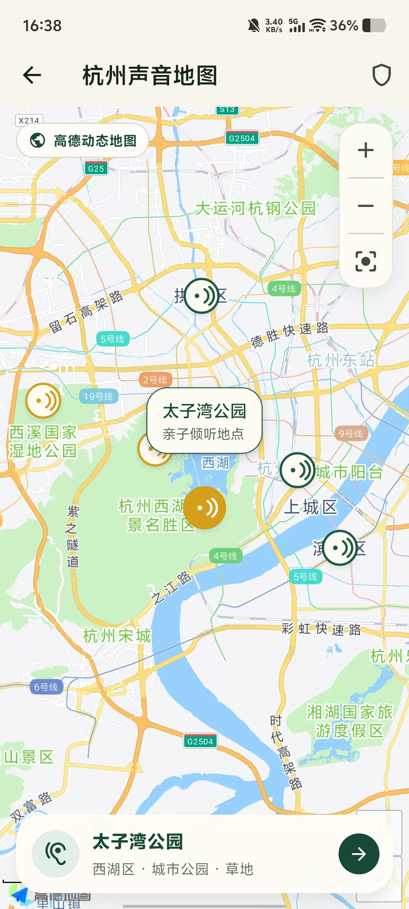
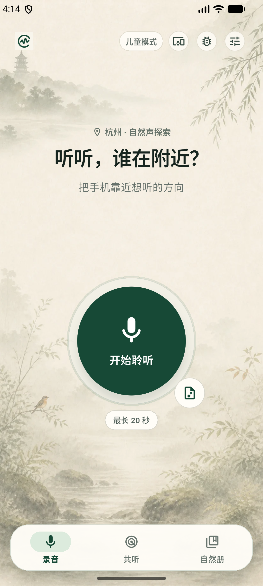
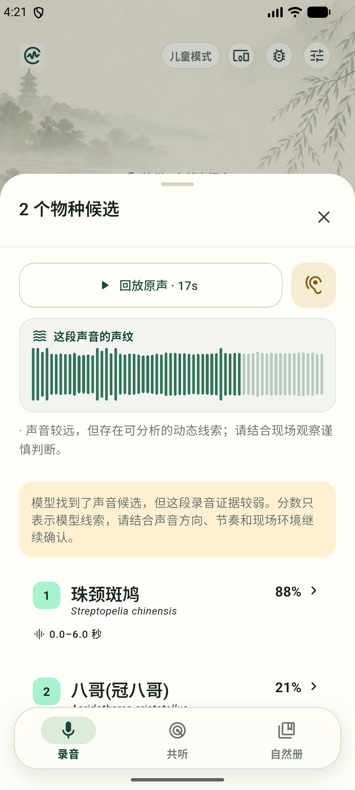
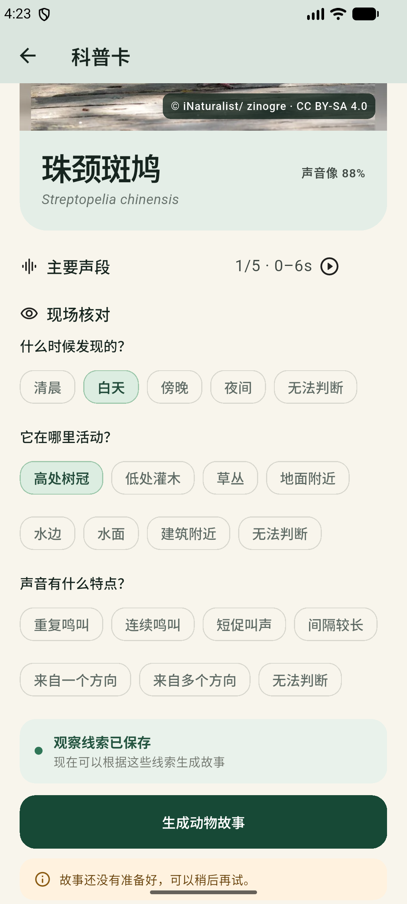
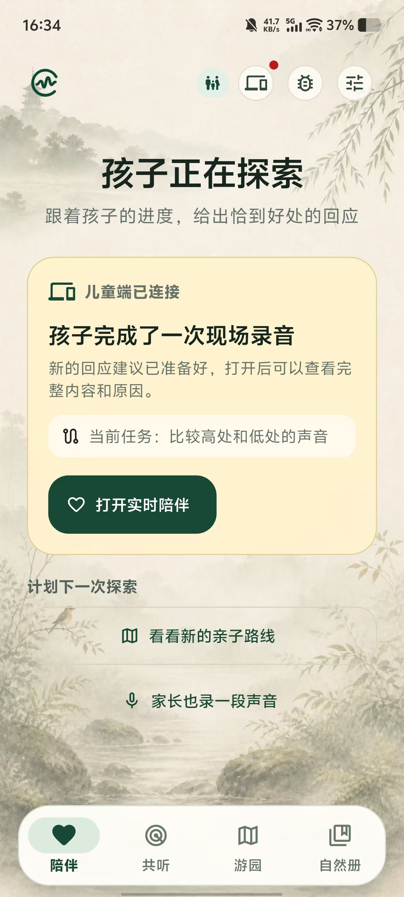
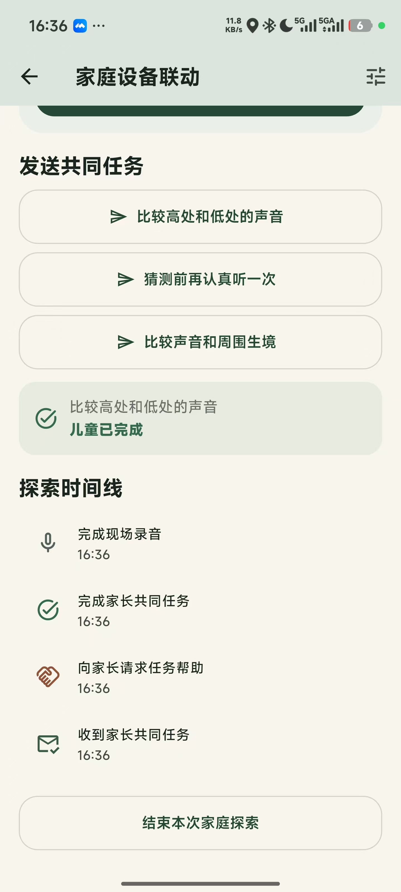
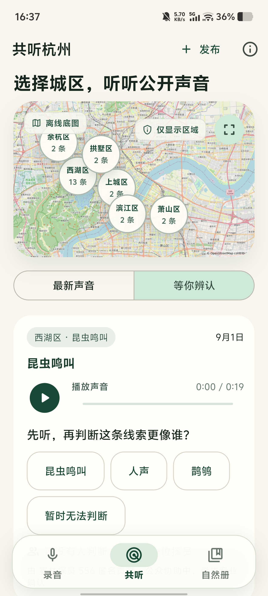
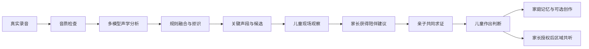
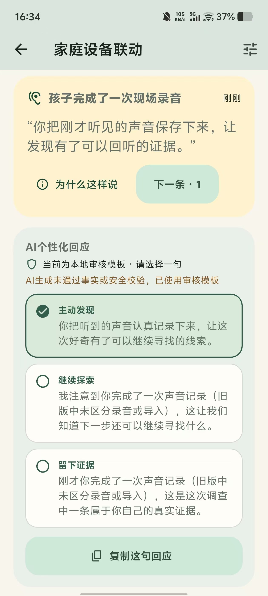

# 自然声探员

> 让孩子从一段自然原声出发。  
> 完成一次真实的自然调查。

---

## 1. 项目简介

“自然声探员”是一款面向 6—12 岁儿童及其家庭的 AI 亲子自然教育应用。它解决的关键问题是：当孩子走进自然时，即使家长不是动植物专家，也能够知道怎样提问、怎样一起观察、怎样帮助孩子继续探索。产品把城市公园、湿地、植物园和社区绿地变成可以随时进入的自然课堂，让孩子从一段看不见来源的真实声音出发，主动倾听、记录和求证，也让家长在共同任务中真正参与进来。

孩子录下最长 20 秒的鸟鸣、蛙声、虫鸣、流水或风雨后，AI 先检查录音证据，再提出声景类别、关键声段和物种候选，但不替孩子给出最终答案。系统会把候选转化为孩子可以执行的回听与现场观察问题，同时为家长提供“可以问什么、可以一起做什么、需要避免什么”的即时建议。AI 因此不只是识别声音，更重要的是降低非专业家长开展自然教育的门槛，让一次普通散步变成亲子有事可做、有话可聊、能够共同求证的自然学习过程。

> **AI 降低家长的陪伴门槛，亲子共同完成自然调查。**

| 项目要素 | 自然声探员的回答 |
|---|---|
| 核心用户 | 6—12 岁儿童及其家长，也适用于公园活动和家庭型自然教育 |
| 核心场景 | 城市公园、湿地、植物园、社区绿地及家庭附近的自然空间 |
| 核心任务 | 让孩子有步骤地探索，让非专业家长有方法地陪伴，共同完成“听见—记录—分析—观察—求证—留存” |
| AI 的作用 | 声学模型检查证据并提出候选；生成模型把真实调查进展转化为家长可用的提问、共同任务、科普和创作建议 |
| 核心边界 | 候选不是确认，生成内容不是声学证据，儿童身份、行动轨迹和精确位置不进入公开页 |

---

## 2. 我们要解决的问题

儿童的自然好奇常常发生在一个很短的瞬间：他听见了声音，却看不见它来自哪里。家长通常愿意陪伴，却可能因为不认识物种、不熟悉观察方法，只能回答“不知道”或直接搜索答案，难以把孩子的好奇继续转化为共同活动。结果是孩子虽然走进了自然，亲子之间却缺少可以持续进行的提问、观察和讨论。

现有的一键识别工具重视快速返回名称，但在弱声、混响和多声源环境中容易给出过度确定的结果，也很少告诉家长下一步可以和孩子做什么。因此，我们解决的不是单纯的声音分类问题，而是三个连续问题：AI 如何从真实声音中提供可靠线索，非专业家长如何据此组织亲子观察，以及调查结束后如何在保护儿童隐私的前提下留下家庭记忆或形成可复核的公共线索。

自然声探员做了三个选择：

1. **先判断证据，再谈候选。** 静音、削波或无效录音会建议重录；弱但仍有动态线索的声音可以继续教育调查，但不会被包装成可靠的生态结论。
2. **先继续观察，再接近判断。** 系统保留原声、关键声段、模型来源和候选边界，让孩子能够回听、比较，并用时间、生境和行为信息补足证据。
3. **孩子、家长和 AI 各有边界。** 孩子拥有观察与判断权，家长负责安全、陪伴和公开决定，AI 只提供候选、问题和表达建议。

---

## 3. 孩子主导、家长参与的一次自然调查

### 3.1 走进自然：让孩子先决定想听什么

一次调查从孩子的兴趣开始。家庭可以选择杭州植物园、西溪湿地或太子湾公园，孩子决定今天更想听鸟鸣、蛙声、虫鸣还是水声，家长再结合可用时间、步行距离和无障碍需求确认路线。产品只提供公开分区、审核过的站点和适龄提示，帮助家庭找到适合停下来倾听的位置，不提供儿童精确导航，也不承诺“一定能遇见”某种动物。

*图 1：杭州声音地图。孩子从声音兴趣出发选择亲子倾听地点，家长负责路线与安全，地图只提供公开地点和区域信息。*

### 3.2 听见声音：孩子录下真实原声

到达站点后，孩子先安静倾听，自己决定要记录哪一段声音，再点击“开始”完成最长 20 秒的录音。界面使用麦克风实时能量驱动声纹，并通过“等待声音”“已捕捉声音”等状态帮助孩子稳定手机；静音与暂停时不制造虚假波动。家长此时主要负责环境与行动安全，不需要替孩子判断声音来自什么动物。

录音只保留公园、公开分区、路线和站点等调查上下文，不记录儿童行动轨迹。即使网络不可用，孩子仍然可以完成录音、回听和后续现场观察。

*图 2：开始聆听界面。孩子主动选择和记录声音，本地录音与调查不依赖联网生成服务。*

### 3.3 AI 提供线索，而不是替孩子回答

AI 首先判断录音是否包含可分析的声音证据。静音、削波或过弱的录音会建议重录；证据可用时，系统以“线索显影”的方式展示原声回放、声纹、证据强弱、关键时间片、主要候选和其他候选。孩子可以先回听模型关注的声音片段，再决定下一步观察什么。

候选分数只表示模型在当前录音上的线索强弱，不是物种确认；每项结果都保留模型来源与可回听的时间段。证据不足时，系统会回退到更安全的声音大类，或直接保留不确定，避免用一个看似确定的名称提前结束孩子的好奇。

*图 3：候选分析界面。AI 展示证据、关键声段与候选来源，但不替孩子确认物种。*

### 3.4 带着线索回到现场：调查才真正开始

候选出现后，孩子需要重新听、重新看，并记录声音在什么时候出现、来自哪种生境、怎样重复，以及是否真正看见动物。观察项采用可点选的结构化问题，降低儿童输入负担，也让机器候选和人工观察能够分别保存、日后比较。

这一阶段仍由孩子作出选择：他可以补充新的观察，可以纠正模型，也可以保留“无法判断”。产品把不确定性视为真实调查的一部分，不用奖励机制迫使孩子确认一个物种。

*图 4：现场核对界面。孩子补充自己的观察，人工线索与机器候选分层保存。*

### 3.5 孩子需要帮助时：家长获得方法并加入

当孩子不知道下一步该看什么，或者希望家长一起判断时，家长才从安全陪同者转变为共同调查者。系统根据孩子已经完成的录音、回听和现场观察，为家长整理“可以问什么、可以一起做什么、需要避免什么”，让不具备动植物专业知识的家长也能当场提供有效引导。

例如，孩子认为声音来自树上时，系统不会让家长直接告诉他“这是什么鸟”，而会建议家长请孩子先指出方向，再一起换一个观察位置，比较声音是否仍然来自同一侧。亲子由此获得一个可以立即完成的共同活动，而不是各自低头等待搜索结果。

家长可以在同一设备中切换家长模式，也可以通过临时连接参与调查。AI 只提供多条陪伴建议，不直接替家长发言；最终由家长决定使用哪一种问法，并保留真实关系中的语气和情感表达。

*图 5：家长陪伴与共同任务。家长查看进展、发送共同任务，不代替孩子判断。*

### 3.6 亲子共同求证：由孩子作出判断

完成共同观察后，孩子回到原声、机器候选和自己的现场记录，作出本次调查的判断。他可以确认候选、选择更接近的声音大类、纠正结果，或保留“暂时不知道”。家长可以和孩子讨论依据，但不能在儿童端替孩子完成物种确认。

这一角色分工贯穿整个产品：孩子负责发现、记录和判断，AI 负责提供证据线索与行动方法，家长负责陪伴、安全和共同活动。只有在公开与分享环节，家长才拥有最终决定权。

### 3.7 调查完成后：成为家庭记忆或城市线索

原声、候选、观察和路线上下文默认保存在本机自然册。完成至少两个有效观察维度后，孩子可以生成动物故事，并把真实原声与科普旁白、AI 配乐和无声画面合成为自然作品。生成内容会明确标记，不反过来修改调查证据。

只有家长完成独立授权后，匿名区域线索才能进入“共听杭州”。公开页区分真实声音、AI 作品和体验示例，且公开记录可以撤回。孩子还可以从一次候选继续查看同一区域、相近生境的公开声景；系统按生境扩展探索，而不是把某个候选物种误解为附近唯一存在的声音。

*图 6：“共听杭州”。页面以城区汇总公开声音，支持原声回听和结构化协助，不展示儿童精确位置。*

---

## 4. 三项核心创新

### 4.1 面向非专业家长的 AI 陪伴支架

普通家长愿意带孩子走进自然，却不一定认识物种，也不熟悉自然观察方法。自然声探员根据孩子已经完成的录音、回听和现场观察，为家长提供“可以问什么、可以一起做什么、需要避免什么”的即时建议，把专业的观察方法转化为家庭当场能够完成的简单活动。

AI 不直接替家长发言，也不把机器候选包装成确定事实。它提供多个提问方向、共同任务和回应备选，再由家长结合现场情况与亲子关系作出选择。由此降低的不是声音识别难度，而是非专业家长组织亲子自然教育活动的门槛。

### 4.2 以儿童为主体的证据式自然调查

产品不以“识别出一个名字”作为完成标准，而是把录音质量、原声回放、关键声段、机器候选和现场问题连接起来。孩子获得候选后仍需回到声音和现场，继续记录时间、生境、声音规律和目击情况，再根据全部证据确认、纠正或保留未知。

机器候选与儿童观察始终分层保存，“暂时不知道”也是有效的调查结果。候选页因此不是体验终点，而是连接回听、现场观察、亲子共同任务和相关生境声景的中间节点。AI 的价值不是更快结束问题，而是延长孩子的好奇，并帮助他形成基于证据的判断习惯。

### 4.3 从家庭自然记忆到可控的公共协作

一次调查首先保存在本机自然册中，成为家庭可以反复回听和补充的自然记忆。孩子可以基于真实原声与本次观察生成故事、科普旁白、配乐和画面，但机器候选、人工观察与生成作品保持来源可区分，创作内容不能反过来修改调查证据。

只有家长完成独立授权后，匿名的区域级线索才会进入“共听杭州”，供其他参与者继续倾听并提供结构化协助。公开记录不包含儿童身份、行动轨迹和精确位置，并且可以撤回。这条路径让一次亲子发现能够从家庭自然教育延伸到公众参与，同时保持清晰、可控和可追溯的授权边界。

---

## 5. AI 与技术方案

自然声探员使用两类职责不同的 AI。**声学 AI**从真实录音中检查证据、定位关键声段并提出声音候选，帮助孩子找到继续观察的起点；**生成式 AI**只读取经过约束的候选、观察和行为摘要，把调查进展转化为家长可以使用的提问、共同任务，以及调查完成后的科普与创作建议。前者回答“可能听到了什么”，后者帮助家庭决定“接下来可以一起做什么”，两者都不替孩子作最终判断。

- **录音证据：**YAMNet、BirdNET 2.4 和非鸟实验分类头共同提出声景类别、关键声段与候选；规则层保留来源并拒绝证据不足的结果，必要时回退到声音大类或“无法判断”。
- **亲子支架：**生成模型只读取受控候选、儿童观察和真实行为摘要，用于家长提问、共同任务及可选创作，不参与核心声学判断。
- **本地优先：**录音、回听、观察和自然册不依赖联网；公开声景、跨设备同步和生成服务失败时，不影响孩子继续完成调查。

移动端以 Flutter 和 Kotlin 承担调查流程、录音与地图能力，Python/FastAPI 提供社区、家庭同步和可选生成服务。技术选择最终服务于三个产品原则：证据可回听、候选不冒充答案、儿童观察独立保存。

---

## 6. 当前成果与验证边界

### 6.1 已经可以演示的核心闭环

当前 Android 工作区已经可以演示“孩子主导、家长参与”的完整旅程：

1. 孩子选择公园与声音兴趣，在真实环境中完成录音；
2. 端侧完成音质检查、候选分析和关键声段定位；
3. 孩子回听原声并补充时间、生境、声音规律和目击情况；
4. 家长通过同设备模式或临时家庭连接获得共同任务与过程性回应；
5. 亲子共同求证后，由孩子确认、纠正或保留未知；
6. 调查进入本机自然册，并可在家长授权后匿名进入“共听杭州”。

围绕这条主闭环，产品还完成了亲子游园指南、路线站点聆听、可恢复的故事与影音作品、公共声景地图、结构化协助，以及真实数据、体验数据和生成作品的分层与撤回。Web 展示版和 ModelScope CPU 参考实现用于降低体验门槛，但不等同于 Android 端的完整亲子调查流程。

候选结果的“线索显影”、录音状态反馈，以及从候选进入相关生境声景的连续路径均已完成开发并推送至公开主分支 `058d88f`。该提交对应的 Android APK CI 已通过静态分析、测试和 arm64 Release APK 构建，并上传最新持续构建产物 `xykw-android-arm64-55`。项目目前同时提供 `0.4.1` 稳定版和包含决赛更新的最新持续构建。

### 6.2 初赛提交后的用户反馈与迭代

`0.1.0` 初赛版本提交后，团队将体验反馈和实际调试中反复出现的问题持续写入产品迭代。截至 2026-09-02 的 `058d88f`，初赛版本之后共有 51 个 Git 提交。它们不是简单增加功能，而是围绕“孩子能否继续探索、非专业家长能否真正参与”逐步修正产品。

| 归纳的用户反馈 | 对应的产品改进 | 代表提交 |
|---|---|---|
| 家长愿意陪伴，但不知道该问什么，也担心直接告诉孩子答案 | 增加儿童/家长模式、即时陪伴建议、共同任务、临时家庭连接和过程性回应，并完善生成失败时的安全回退 | `10964f9`、`9e007d8`、`76dbea7`、`76547e2` |
| 孩子看到识别候选后，不清楚下一步还能做什么 | 将故事和作品建立在现场观察之上，加入回听、结构化观察、相关路线和生境声景，让候选成为调查起点 | `562913e`、`5551b8b`、`90a4b12`、`3a66d3c` |
| 户外录音时不容易判断是否录到有效声音，识别结果也缺少证据感 | 增加真实声纹、录音状态反馈、音质边界、关键声段和“线索显影”，帮助孩子理解系统听到了什么 | `fbf2f55`、`3a66d3c` |
| 公园推荐和路线选择在数据不足或接口异常时不够稳定 | 重做亲子游园指南，稳定接口加载，并在缺少真实记录时仍保留可理解、可选择的公园入口 | `a4f92a9`、`3e774d5`、`058d88f` |
| 家庭设备、自然册、路线和公共声景之间切换割裂，公开声音也不够容易回听 | 完善双设备联动、社区地图和音频播放，把个人录音、路线活动与相关区域声景连接起来 | `5c3c1b5`、`a16b0f3`、`90a4b12` |
| 生成服务受模型权限、网络或内容安全约束时，失败提示不清楚 | 区分安全警告与服务不可用，减少不必要权限，在模型不可用时跳过受限能力并保留其他调查与创作流程 | `2b5223a`、`8b3f4d7`、`2611862`、`98dc20a`、`0cc3193` |

这些记录证明产品经历了连续的反馈—修正过程，但不能替代正式用户研究：目前尚未形成可报告的家庭样本量、任务完成率或前后测结果。因此本文只陈述反馈推动了哪些设计变化，不把调试记录包装成教育效果结论。

### 6.3 尚未完全解决的用户反馈

体验反馈还暴露了以下未完成问题。这里采用匿名归纳，不展示聊天账号和原始截图，也不把单次体验意见解释为量化结论。P0 表示影响结果正确性或信任，P1 表示直接影响儿童使用与学习，P2 表示影响产品定位和长期体验。

| 优先级 | 尚未闭环的反馈 | 当前判断与下一步 |
|---|---|---|
| P0 | 同一段录音可能同时出现鸟类与昆虫线索，科普卡内容又可能与页面主候选不一致 | 当前界面已开始区分“主候选”和“同时听到”，但跨页面结果绑定仍需统一。下一步以同一结果 ID 固定主候选、科普卡和关键声段，并增加鸟类/昆虫混合场景的端到端回归检查 |
| P0 | 孩子完成选择后仍不知道“为什么这样判断”，也不知道自己的选择是否合理 | 不能简单把候选当标准答案，也不能只留下“无法判断”。下一步在选择后展示“机器候选、儿童观察、可回听依据”三层反馈，说明当前证据支持什么、还缺少什么，并保留纠正与未知选项 |
| P1 | 物种名称文字较难，低龄儿童可能不认识“鹊鸲”等名称；识别页面缺少足够的图片与画面吸引力 | 当前已接入物种图片框架，但人工审核媒体覆盖仍很少。下一步优先覆盖杭州常见物种，增加大图、简短特征、拼音或语音朗读，同时减少结果页一次出现的文字量 |
| P1 | 缺少可对照的参考声音，孩子无法先听“典型鸟鸣/虫鸣”再比较自己的录音 | 下一步为常见声音大类和审核过的物种增加短参考音，明确来源与许可证，设计“听原声—听参考—再判断”的对比任务；参考音只用于学习，不作为本次录音的确认依据 |
| P1 | 部分功能入口和下一步动作不够清楚，用户不知道录音、科普、观察、共听之间如何衔接 | 下一步减少并列入口，按“回听关键声段—补充观察—邀请家长—继续附近声景”的顺序渐进呈现，每一步只突出一个主要动作 |
| P2 | 产品仍容易被理解为普通声音识别工具，与 Merlin Bird ID 等识别产品的差异不够直观 | 社区、生境和路线联动已经实现基础能力，但需要在结果页更明确地展示“从这次发现继续听附近”“寻找下一个声音地点”，用亲子共同任务和连续调查强化产品定位 |

这些问题将按“结果一致性与儿童理解优先、交互发现性其次、社区连续体验持续完善”的顺序处理。正式验收时需要记录问题复现条件、修正版本和真实家庭复测结果，不能只以代码完成作为反馈关闭依据。

### 6.4 可复核的当前数据

| 验证项 | 当前结果 | 结论边界 |
|---|---:|---|
| Python 全量测试 | 180 项通过 | 覆盖声学服务、社区、家庭会话、创作和契约回归 |
| Flutter 验证 | 静态分析 0 问题，179 项测试通过 | 2026-09-02 当前工作区的 `make verify` 结果 |
| 最新 Android 持续构建 | `058d88f` 构建成功 | Android APK CI 已完成静态分析、测试和 arm64 Release APK 构建 |
| 鸟类官方标准声覆盖 | 目标召回 83.33% | 只代表官方标准声，不是杭州户外综合准确率 |
| 非鸟官方检查 | 14 个声源、116 个窗口，声源级召回 78.57% | 不代表杭州公园蛙虫泛化能力 |
| 定向压力测试 | 419 份录音、2,838 个三秒窗口 | 用于暴露手机频响、重采样、低信噪比和混响弱项 |

当前稳定版为 `0.4.1+4002`，通过 GitHub Release 长期提供；决赛更新已进入公开主分支，并通过 GitHub Actions 提供最新 APK 持续构建。稳定版用于长期安装，持续构建用于评审体验最新功能。

### 6.5 仍需补足的证据

- 实体 Android 手机户外录音、延迟、内存和异常恢复验收；
- 真实家庭的调查完成率、主动回听和候选后观察数据；
- 杭州植物园、西溪湿地和太子湾公园的真实观察覆盖；
- 按地点和日期隔离的杭州蛙虫人工真值测试集。

---

## 7. 社会价值、可持续路径与安全边界

### 7.1 从一次倾听到长期自然教育

自然声探员的价值不止是识别一种声音，而是把儿童瞬间的好奇转化为可以回听、观察、讨论和求证的学习过程。它首先服务儿童与家庭，再把经过授权的自然记忆连接到公园活动和城市公众参与。

| 价值对象 | 解决的问题 | 形成的长期价值 |
|---|---|---|
| 儿童 | 听见声音后不知道从哪里观察，也容易把识别结果当作答案 | 练习倾听、比较、记录和基于证据作出判断，保留“暂时不知道”的空间 |
| 家庭 | 家长愿意陪伴，却缺少物种知识和可立即使用的活动方法 | 把普通散步转化为有共同任务、有话可谈、有记忆可留的亲子自然教育 |
| 公园与自然教育机构 | 一次性讲解或打卡活动难以延伸到家庭后续观察 | 形成可复用的场地任务、声音路线、团队自然册和活动前后衔接工具 |
| 城市公众 | 居民与身边自然缺少持续、低门槛的连接 | 在授权与质量控制下积累区域声景记忆，促进绿色生活方式和公众自然关注 |

这套机制尤其回应了一个常被忽略的问题：儿童走进自然时，非专业家长如何真正参与。AI 降低的是家长组织自然教育活动的门槛，而不是代替儿童观察，也不是代替自然教育工作者和生态专家。

### 7.2 可持续运营与商业化路径

项目更适合从“机构组织活动、家庭直接使用”的路径起步，而不是一开始依赖大量家庭订阅。公园和自然教育机构拥有真实场地与活动入口，产品提供可复用的数字任务和调查工具，家庭则获得低门槛体验，形成较清晰的 B2B2C 起点。

| 阶段 | 主要使用者或合作方 | 可持续服务内容 |
|---|---|---|
| 起步期 | 公园、植物园、自然教育机构、亲子活动组织者 | 场地化亲子任务、声音路线、团队自然册、活动模板和活动复盘工具，由机构采购或联合运营 |
| 成长期 | 有持续自然教育需求的家庭 | 基础调查免费；主题任务、家庭自然报告、长期自然册和创作工具可形成低价活动包或订阅 |
| 合作期 | 公益机构、企业社会责任项目和城市公共文化项目 | 季节声景活动、社区共听和公众自然教育内容，在专家复核与隐私规则下联合建设 |

现阶段尚未验证付费转化、机构采购周期和规模化交付成本，因此文档不宣称已经形成收入或成熟商业模式。下一阶段需要通过机构试点记录活动组织成本、家庭完成率、复用率与付费意愿，再决定收费方式。无论采用何种模式，儿童身份、精确位置和私人录音都不作为商业化数据资产。

### 7.3 角色与安全边界

| 角色 | 拥有的权利与职责 | 不承担的职责 |
|---|---|---|
| 儿童 | 发现声音、完成录音与观察，并对候选作出确认、纠正或保留未知 | 不负责公开授权，也不承担生态监测结论责任 |
| 家长 | 保障现场安全、参与共同活动、选择陪伴表达，并决定是否公开与撤回 | 不在儿童端代替孩子确认物种，不需要具备专业物种知识 |
| AI | 检查录音证据、提出候选，并提供观察问题、共同任务和表达建议 | 不作最终物种判断，不替家长发言，不把生成内容写回调查证据 |

- 调查记录默认私人，公开需要家长单独授权；
- 公开页只展示区域级位置，不上传儿童行动轨迹和录音精确坐标；
- 家庭双设备不同步儿童身份和原始录音；
- 机器候选、人工观察和生成内容分层保存；
- 生成回应未通过事实或安全校验时，回退到本地审核模板。

*图 7：家庭连接与安全回退。儿童录音和观察仍保存在本机，家长只接收步骤摘要；生成回应未通过事实或安全校验时，系统改用本地审核模板。*

### 7.4 对绿色发展赛题的回应

| 赛题方向 | 项目产出 |
|---|---|
| 自然声音识别 | 端侧多模型提出声景和物种候选，保留关键声段与证据来源 |
| 科普与教育 | 将候选转化为儿童可执行的回听、观察和求证任务 |
| 亲子自然教育 | 将儿童调查进展转化为非专业家长可用的提问、共同任务和陪伴建议 |
| 艺术与情感共创 | 基于真实原声和本次观察生成故事、旁白、配乐和短片 |
| 公众参与 | 经家长授权的匿名线索进入区域共听，其他参与者提供结构化协助 |

项目当前首先验证的是儿童自然教育、家庭陪伴和公众协作机制，不宣称已形成大规模生态监测网络。公共声景的价值在于让家庭能够听见同一区域、相近生境中的其他记录，并对待辨线索提供结构化协助。只有通过授权、质量分层、人工复核和时空覆盖门槛的记录，未来才可能服务长期声景观察。

---

## 8. 实施计划、团队与体验入口

### 8.1 分阶段实施计划

1. **真实家庭验证：**完成真机户外录音、弱网与异常恢复测试，在杭州植物园、西溪湿地和太子湾公园验证家庭能否独立走完调查闭环，并记录儿童回听、观察和家长参与数据。
2. **机构共创试点：**与公园或自然教育机构共建一套适龄任务和声音路线，验证活动组织成本、家庭完成率、重复使用意愿及机构采购可能性。
3. **区域声景合作：**在专家复核、敏感物种保护和数据质量控制下，逐步扩展季节声景任务与区域公开记录，探索公益项目和城市公共自然教育合作。

### 8.2 团队

- **团队名称：**雨林声纹队
- **所属单位：**中国科学院西双版纳热带植物园

| 团队成员 | 主要分工 |
|---|---|
| 葛庆宇 | 负责产品设计与代码实现，包括整体产品方案、儿童调查流程、移动端与服务端开发、AI 能力接入和技术验证 |
| 梁皓宇 | 负责产品体验与用户需求调研，包括亲子使用场景梳理、体验流程评估、需求反馈整理和产品优化建议 |

两名成员围绕亲子自然教育场景协同工作：产品体验与用户需求反馈进入方案设计和开发迭代，工程实现再通过实际使用流程接受体验检验。涉及真实家庭长期研究、杭州本地物种真值、儿童发展评估和敏感物种保护的工作，下一阶段需要与自然教育工作者、生态专家和真实家庭共同完成，不以生成式 AI 代替专业审查。

### 8.3 体验与证据入口

- **立即体验｜ModelScope：**免安装体验在线声音分析参考实现。<https://modelscope.cn/studios/gqy2025/nature-sound-detective>
- **立即体验｜Web：**查看产品定位与轻量展示流程。<https://listen.gqy20.top/>
- **稳定安装｜Android 0.4.1：**从 GitHub Release 下载长期保留的稳定版 APK。<https://github.com/gqy20/nature-sound-detective/releases/tag/0.4.1>
- **最新构建｜Android 决赛更新：**查看 `058d88f` 的成功构建并下载 `xykw-android-arm64-55` APK 产物。<https://github.com/gqy20/nature-sound-detective/actions/runs/33611045754>
- **技术复核｜GitHub：**查看项目源码、技术文档、测试与版本记录。<https://github.com/gqy20/nature-sound-detective>

> **让每一次走进自然，都留下可以继续生长的观察。**
